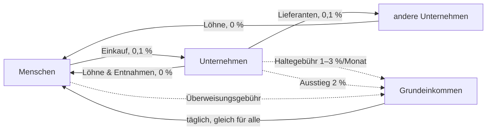

# Aequitas für Unternehmen – Konzept

Stand: 25.09.2026 · Status: **Entwurf zur Entscheidung** (nichts davon ist gebaut)

## In einem Satz

Unternehmen dürfen AEQ annehmen, halten und ausgeben – aber AEQ ist so
gebaut, dass es **durch Unternehmen hindurchfließt und bei Menschen ankommt**:
Liegenlassen kostet, an Menschen weitergeben ist gratis, Aussteigen in
Euro/Dollar kostet eine Abgabe, die ins Grundeinkommen geht.

---

## 1. Warum nicht „Unternehmen nur in USD“?

Die naheliegende Idee – Menschen halten AEQ, Unternehmen nehmen nur Stablecoins –
schützt das Geld nicht, sondern entwertet es:

1. Jeder Einkauf wird zu einem **Verkauf von AEQ** (AEQ → Stable → Händler).
2. Käufer für AEQ gibt es dann kaum: Wofür sollte jemand AEQ kaufen, wenn man
   damit nirgends bezahlen kann?
3. Dauerhafter Verkaufsdruck, **fallender Kurs**, das Grundeinkommen ist immer
   weniger wert. AEQ würde zur Wertmarke, die man sofort loswerden will.

Dazu kommen Reibung bei jedem Einkauf (Tausch, Kursrisiko, Liquidität) und die
Abhängigkeit von einem Stablecoin-Anbieter. **Zirkulation entsteht nur, wenn
Unternehmen AEQ selbst weitergeben können** – an Beschäftigte, Lieferanten,
andere Unternehmen.

## 2. Leitlinien

1. **Das Geld ist für Menschen.** Grundeinkommen, Stimmrecht und der faire
   Anteil gehören nur verifizierten Menschen.
2. **Unternehmen sind Durchlauf, kein Speicher.** Wer AEQ hortet, zahlt. Wer es
   weitergibt, zahlt nichts.
3. **Kein Vorrecht, kein neues Geld.** Für Unternehmen wird kein AEQ geschöpft.
   Alles, was sie zahlen, fließt ins Grundeinkommen.
4. **Hinter jedem Unternehmen steht ein Mensch.** Verantwortung ist nicht
   anonym, das Unternehmen selbst kann es sein.
5. **Einfach für den Laden.** Bezahlen per QR, Preise auch in Euro sichtbar,
   Buchhaltungs-Export. Ohne das nimmt kein Bäcker AEQ an.

## 3. Die Lücke, die dieses Konzept mit schließt

`docs/WHO_MAY_HOLD_AEQ.md` (20.08.2026) regelt: *Jeder darf AEQ halten, jede
Adresse unterliegt Demurrage und Vermögensgrenze.* Zwei Punkte halten im Code
nicht, was die Regel verspricht:

- **Die Vermögensgrenze gilt pro Adresse, nicht pro Mensch.** 25.000 AEQ je
  Adresse (`wealthCapMultiplier` × fairer Anteil). Wer sein Vermögen auf zehn
  unregistrierte Adressen verteilt, hat eine Grenze von 250.000 AEQ. Adressen
  kosten nichts, die Grenze hält also nicht.
- **Demurrage trifft aktive Konten nie.** Sie beginnt erst nach 90 Tagen ohne
  Bewegung (`demurrageGracePeriodSeconds`), jede Bewegung setzt die Uhr zurück.
  Die tägliche UBI-Gutschrift setzt sie bei jedem Menschen zurück, ein aktives
  Unternehmen setzt sie mit jedem Verkauf zurück. Sie ist in der Praxis ein
  Aufräumen verlassener Konten, keine Umlaufsicherung (so auch schon in
  `WHO_MAY_HOLD_AEQ.md` festgestellt).

Ein Unternehmensmodell auf dieser Grundlage hätte weder eine Grenze noch einen
Umlaufanreiz. Deshalb braucht es drei Kontoarten mit klaren Regeln statt einer.

## 4. Drei Kontoarten

| | **Mensch** | **Unternehmen** (neu) | **Freie Adresse** |
|---|---|---|---|
| Wer | verifizierter Mensch | eröffnet von 1–N verifizierten Menschen | jede sonstige Adresse, auch Verträge |
| Grundeinkommen | ✅ | ❌ | ❌ |
| Stimmrecht | ✅ | ❌ | ❌ |
| Obergrenze | 25.000 AEQ (wie heute) | **keine feste** – dafür Haltegebühr (5.2) | **1.000 AEQ** (= fairer Anteil) |
| Umlaufsicherung | heutige Demurrage | **Haltegebühr über dem Freibetrag, unabhängig von Aktivität** | **1 %/Monat ab dem ersten AEQ, ohne Schonfrist** |
| Umtausch in Stable | 0,1 % bis 1.000 AEQ/Monat, darüber 2 % | 2 % | 2 % |

Die **freie Adresse** bleibt für alles Kleine möglich: Geldbörse eines Besuchers,
Test, Trinkgeldkasse, ein einfacher Vertrag. Als Versteck taugt sie nicht mehr:
höchstens 1.000 AEQ je Adresse, und Halten kostet vom ersten Tag an. Wer mehr
Geld dauerhaft außerhalb des eigenen Kontos halten will, eröffnet ein
Unternehmenskonto und steht mit seinem Namen dafür.

Die **Protokoll-Töpfe** (UBI, LP, Validatoren) bleiben wie heute ausgenommen,
sie sind Durchlauf.

## 5. Regeln für Unternehmenskonten

### 5.1 Eröffnen, Mitinhaber, Schließen

- **Eröffnen:** Transaktion `unternehmen_eroeffnen`, signiert von einem
  verifizierten Menschen. Enthält einen Anzeigenamen (freiwillig) und eine
  Kategorie (z. B. Lebensmittel, Handwerk, Dienstleistung, Verein).
- **Mitinhaber:** weitere verifizierte Menschen können beitreten
  (`unternehmen_mitinhaber`, signiert vom Beitretenden und einem bisherigen
  Verantwortlichen). So bildet ein Konto eine GbR, GmbH oder Genossenschaft ab.
- **Grenze:** Jeder Mensch ist für **höchstens 3 Unternehmenskonten**
  verantwortlich. Das verhindert, dass jemand den Freibetrag über viele Konten
  vervielfacht.
- **Schließen:** Das Restguthaben geht zu gleichen Teilen an die
  Verantwortlichen (gebührenfrei, aber unter ihrer 25.000-Grenze). Was darüber
  liegt, geht ins Grundeinkommen.
- **Öffentlich im Explorer:** Anzeigename, Kategorie, Zahl der Verantwortlichen,
  Umsatz- und Lohnsummen je Monat. **Nicht öffentlich:** welche Menschen dahinter
  stehen (nur „verifiziert: ja, Anzahl: 2“).

### 5.2 Haltegebühr statt Obergrenze

Ein Unternehmen hat Umsatz, und Umsatz ist kein Vermögen. Eine Bäckerei mit
40.000 AEQ Monatsumsatz würde an einer 25.000-Grenze scheitern, ohne reich zu
sein. Deshalb gilt für Unternehmen **keine feste Obergrenze**, sondern eine
Gebühr auf das, was *liegen bleibt*:

- **Freibetrag** = größer von **5.000 AEQ** und **den Ausgaben des Vormonats**
  (Löhne, Lieferanten, andere Unternehmen, Entnahmen). Wer viel weitergibt, darf
  auch viel Betriebsmittel halten.
- Auf den Teil **zwischen Freibetrag und 3 × Freibetrag: 1 % pro Monat.**
- Auf den Teil **über 3 × Freibetrag: 3 % pro Monat.**
- Läuft **sekundengenau** (wie die heutige Demurrage) und wird bei jeder Bewegung
  verrechnet. Es gibt **keine Schonfrist, und Aktivität setzt nichts zurück.**
  Genau das unterscheidet sie von der heutigen Demurrage.
- Die Einnahmen gehen **zu 100 % ins Grundeinkommen.**

Zum Vergleich: Der Chiemgauer verliert rund 2 % je Quartal (≈ 0,66 %/Monat),
Wörgl 1932 hatte 1 %/Monat. 1 % liegt also in der erprobten Spanne. 3 % gelten
nur für echtes Horten.

### 5.3 Gebühren nach Richtung

| Richtung | Gebühr | Begründung |
|---|---|---|
| Mensch → Unternehmen (Einkauf) | 0,1 % wie jede Überweisung, zahlt der Käufer obendrauf | Preis 10 AEQ bringt dem Laden genau 10 AEQ |
| **Unternehmen → Mensch** (Lohn, Entnahme, Erstattung) | **0 %** | der Weg, den das Geld nehmen soll, ist der günstigste |
| Unternehmen → Unternehmen (Lieferant) | 0,1 %, **ohne** den Aufschlag für große Guthaben | Lieferketten sollen nicht bestraft werden, Horten regelt 5.2 |
| Unternehmen → freie Adresse | 0,1 % | |

Der heutige Aufschlag für große Guthaben (+0,1 / +0,5 / +1 % ab 5/10/20 × fairer
Anteil) gilt **nur für Menschen und freie Adressen**. Bei Unternehmen übernimmt
die Haltegebühr diese Rolle, sonst würden gerade Unternehmen mit vielen Löhnen
doppelt zahlen.

### 5.4 Umtausch in Euro/Dollar: Ausstiegsabgabe

| Wer tauscht AEQ → Stable | Abgabe |
|---|---|
| Mensch, bis 1.000 AEQ je Kalendermonat | 0,1 % (wie heute) |
| Mensch, darüber | 2 % |
| Unternehmen | 2 % |
| Freie Adresse | 2 % |

Die Abgabe geht **zu 100 % ins Grundeinkommen.** Stable → AEQ (Einsteigen)
bleibt bei 0,1 %.

**Warum ein Freibetrag pro Mensch und nicht pro Adresse:** Ohne ihn könnte ein
Unternehmen seine Einnahmen gebührenfrei an den Inhaber zahlen, und der
tauscht für 0,1 % um. Mit dem Freibetrag lassen sich über diesen Umweg höchstens
1.000 AEQ im Monat pro Mensch herausnehmen. Da jeder Mensch nur einmal existiert,
lässt sich dieser Freibetrag nicht vervielfachen. Das ist der eigentliche Vorteil
von Aequitas: **Regeln pro Mensch sind hier wirklich durchsetzbar.**

Richtwert: Der Chiemgauer verlangt beim Rücktausch 5 %. 2 % liegen darunter und
im Bereich üblicher Kartengebühren für kleine Händler.

## 6. Der Kreislauf

Jeder Weg, auf dem AEQ **bei Unternehmen liegen bleibt oder das Netz verlässt**,
speist das Grundeinkommen. Jeder Weg **zurück zu Menschen** ist gratis.

## 7. Rechenbeispiele

**Café** – Monatsumsatz 3.000 AEQ, Löhne 1.500, Lieferant 800, Entnahme 600.
Kontostand bleibt um 2.000 AEQ, der Freibetrag liegt bei mindestens 5.000:
**keine Haltegebühr.** Abgaben nur, wenn es in Euro tauscht.

**Supermarkt, der hortet** – Ausgaben im Vormonat 40.000 AEQ, Freibetrag
40.000. Kontostand 200.000 AEQ:
- 40.000 bis 120.000 → 80.000 × 1 % = 800 AEQ/Monat
- über 120.000 → 80.000 × 3 % = 2.400 AEQ/Monat
- zusammen **3.200 AEQ/Monat ins Grundeinkommen**, bis das Geld wieder
  ausgegeben ist. Zahlt er stattdessen Löhne, sinkt die Gebühr, und das Geld
  landet direkt bei Menschen.

**Jemand, der Vermögen verstecken will** – 100 freie Adressen à 1.000 AEQ:
1 %/Monat auf alles, also 1.000 AEQ im Monat. Über ein Unternehmenskonto
mit 5.000 Freibetrag: 95.000 AEQ weit über 3 × Freibetrag, also überwiegend
3 %/Monat. **Verstecken lohnt sich in keiner Form.**

## 8. Was Läden brauchen, damit sie mitmachen

- **Kassenmodus in der App:** Betrag eingeben → QR-Code → Kunde scannt und
  zahlt → Beleg. Preise wahlweise in AEQ oder als Euro-Gegenwert zum aktuellen
  Kurs.
- **Buchhaltungs-Export (CSV):** jede Zahlung mit Datum, Betrag in AEQ und
  **Euro-Wert zum Zahlungszeitpunkt**. Ohne den nimmt kein Steuerberater es an.
- **Sofort-Ausstieg auf Wunsch:** Wer kein Kursrisiko tragen will, tauscht
  Einnahmen automatisch um (2 %). Die Wahl bleibt beim Laden.
- **Argumente für den Laden:** Die Zahlung ist für den Laden gebührenfrei, der
  Kunde zahlt 0,1 %. Kunden mit Grundeinkommen wollen es ausgeben, und Löhne
  lassen sich gebührenfrei in AEQ zahlen.

## 9. Was an der Kette gebaut werden muss

Alles hinter einer **Aktivierungshöhe** (wie `grant_staffel.go`), damit alte
Blöcke gleich nachgespielt werden. Da die Kette vor dem Launch bei null startet,
gibt es keine Altbestände umzustellen.

1. `AccountState`: Feld `Kontoart` (mensch / unternehmen / frei),
   `Verantwortliche []Adresse`, `AusgabenVormonat`, `AusgabenLaufenderMonat`,
   `MonatsTausch` (für den Freibetrag beim Umtausch).
2. Neue Transaktionen: `unternehmen_eroeffnen`, `unternehmen_mitinhaber`,
   `unternehmen_schliessen`.
3. `enforceWealthCapLocked`: Unternehmen ausgenommen, freie Adressen auf
   1.000 AEQ.
4. `haltegebuehr.go`: Freibetrag, Stufen, sekundengenaue Verrechnung, Gutschrift
   ans Grundeinkommen. Nach dem Muster von `effectiveBalance`, aber ohne
   Schonfrist und ohne Zurücksetzen durch Aktivität.
5. `ueberweisungsgebuehr.go`: Gebühr nach Richtung (5.3).
6. Swap AEQ → Stable: Ausstiegsabgabe mit Monatsfreibetrag pro Mensch (5.4).
7. Tests: Verteilen auf Adressen lohnt nicht, Gebühren je Richtung, Umweg über
   den Inhaber ist gedeckelt, Nachspielen ist deterministisch.
8. Explorer: Unternehmensregister. App: Kassenmodus und CSV-Export.

Grober Aufwand: Kette 1–2 Wochen, App-Kassenmodus 1 Woche.

## 10. Recht und offene Punkte (ehrlich)

- **Steuern:** Für Unternehmen sind AEQ-Einnahmen Betriebseinnahmen zum
  Euro-Wert am Zahlungstag. Deshalb ist der CSV-Export Pflicht.
- **MiCA / Finanzaufsicht:** Ob AEQ und der eingebaute Tausch unter die
  EU-Kryptoverordnung fallen, muss **vor echtem Geld** rechtlich geprüft werden.
  Das betrifft das ganze Projekt, nicht nur Unternehmen.
- **Echter Stablecoin:** Heute gibt es nur tUSD (Testwährung). Für echten
  Ausstieg braucht es einen regulierten Euro-Stablecoin (z. B. EURC) und eine
  Brücke. Das kommt erst nach der rechtlichen Prüfung.
- **Kursrisiko für Läden:** Solange AEQ klein ist, schwankt der Kurs. Der
  Sofort-Ausstieg (8.) ist die Antwort für vorsichtige Läden.
- **Die Zahlen sind Startwerte** (Freibetrag 5.000, 1 %/3 %, 2 %, 1.000/Monat).
  In der Pilotstadt messen, dann per Abstimmung der Menschen anpassen.

## 11. Einführung in Schritten

1. **Entscheidung** über die Zahlen in Abschnitt 12.
2. **Kette** bauen und testen (Abschnitt 9), vor dem Neustart bei null.
3. **App**: Kassenmodus und Export.
4. **Pilotstadt**: 5–10 Läden (Café, Bäcker, Hofladen, Friseur, Werkstatt), drei
   Monate, messen: Wie viel bleibt im Kreislauf, wie viel geht raus, wie viel
   landet im Grundeinkommen?
5. **Rechtliche Prüfung** und echter Stablecoin, dann breiter öffnen.

## 12. Zu entscheiden

| Frage | Vorschlag |
|---|---|
| Freibetrag Unternehmen | größer von 5.000 AEQ und den Vormonatsausgaben |
| Haltegebühr | 1 %/Monat bis 3 × Freibetrag, 3 %/Monat darüber |
| Ausstiegsabgabe | 2 % (Menschen: erste 1.000 AEQ/Monat zu 0,1 %) |
| Obergrenze freie Adresse | 1.000 AEQ, 1 %/Monat ab dem ersten AEQ |
| Unternehmenskonten pro Mensch | höchstens 3 |
| Löhne/Entnahmen an Menschen | gebührenfrei |
| Wohin gehen alle Abgaben | 100 % Grundeinkommen |

## Vorbilder

- **Chiemgauer** (Bayern, seit 2003): Regionalgeld mit Umlaufsicherung, 5 %
  Rücktauschgebühr zugunsten von Vereinen, hunderte teilnehmende Geschäfte.
- **WIR-Bank** (Schweiz, seit 1934): Verrechnungsgeld zwischen Unternehmen,
  stabilisierend in Krisen.
- **Wörgl** (Österreich, 1932): Schwundgeld mit 1 %/Monat. Das Geld lief so
  schnell um, dass die Gemeinde damit Straßen und Brücken baute, bis die
  Nationalbank es verbot.
