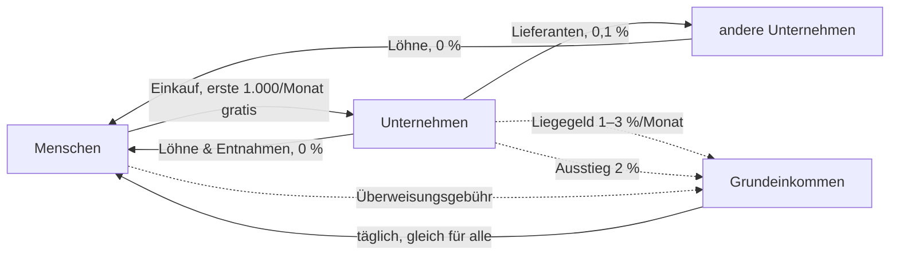

# Aequitas für Unternehmen – Konzept

Stand: 25.09.2026 · Status: **beschlossen und gebaut**, aktiv ab 01.10.2026 (`x/humanity/keeper/wirtschaft.go`)

## In einem Satz

Unternehmen dürfen AEQ annehmen, halten und ausgeben – aber AEQ ist so
gebaut, dass es **durch Unternehmen hindurchfließt und bei Menschen ankommt**:
Liegenlassen kostet, an Menschen weitergeben ist gratis, Aussteigen in
Euro/Dollar kostet eine Abgabe, die ins Grundeinkommen geht.

---

## 1. Warum nicht „Unternehmen nur in USD“?

Die naheliegende Idee – Menschen halten AEQ, Unternehmen nehmen nur Stablecoins –
schützt das Geld nicht, sondern entwertet es:

1. Jeder Einkauf wird zu einem **Verkauf von AEQ** (AEQ → Stable → Händler).
2. Käufer für AEQ gibt es dann kaum: Wofür sollte jemand AEQ kaufen, wenn man
   damit nirgends bezahlen kann?
3. Dauerhafter Verkaufsdruck, **fallender Kurs**, das Grundeinkommen ist immer
   weniger wert. AEQ würde zur Wertmarke, die man sofort loswerden will.

Dazu kommen Reibung bei jedem Einkauf (Tausch, Kursrisiko, Liquidität) und die
Abhängigkeit von einem Stablecoin-Anbieter. **Zirkulation entsteht nur, wenn
Unternehmen AEQ selbst weitergeben können** – an Beschäftigte, Lieferanten,
andere Unternehmen.

## 2. Leitlinien

1. **Das Geld ist für Menschen.** Grundeinkommen, Stimmrecht und der faire
   Anteil gehören nur verifizierten Menschen.
2. **Unternehmen sind Durchlauf, kein Speicher.** Wer AEQ hortet, zahlt. Wer es
   weitergibt, zahlt nichts.
3. **Kein Vorrecht, kein neues Geld.** Für Unternehmen wird kein AEQ geschöpft.
   Alles, was sie zahlen, fließt ins Grundeinkommen.
4. **Hinter jedem Unternehmen steht ein Mensch.** Verantwortung ist nicht
   anonym, das Unternehmen selbst kann es sein.
5. **Einfach für den Laden.** Bezahlen per QR, Preise auch in Euro sichtbar,
   Buchhaltungs-Export. Ohne das nimmt kein Bäcker AEQ an.

## 3. Die Fairness-Garantie für Menschen

> **Vereinfacht durch Abschnitt 14.5** (beschlossen 25.09.2026): keine
> Gebührenstufen mehr, Umtausch 3.000 AEQ im Monat frei, egal woher.

Das fairste Geld der Welt muss sich zuerst für den einzelnen Menschen fair
anfühlen, und zwar für den mit wenig. Deshalb gelten für Menschen sechs Zusagen.
Alle Zahlen im Rest dieses Konzepts ordnen sich ihnen unter.

1. **Dein fairer Anteil ist unantastbar.** Auf die ersten 1.000 AEQ (der faire
   Anteil) gibt es nie Demurrage oder Abgabe.
2. **Der Alltag kostet nichts.** Die ersten **1.000 AEQ, die du im Monat
   ausgibst** (an Menschen oder Läden), sind **gebührenfrei**. Die
   Überweisungsgebühr zahlt erst, wer mehr ausgibt.
3. **Lohn ist Lohn.** AEQ, das du als Lohn von einem Unternehmen bekommst,
   kannst du bis 3.000 AEQ im Monat **ohne Abgabe** in Euro/Dollar tauschen.
   Zusätzlich hat jeder
   Mensch **1.000 AEQ im Monat** Tausch-Freibetrag.
4. **Sparen ist erlaubt.** Bis **5.000 AEQ** (5 × fairer Anteil) verliert
   Erspartes nichts. Erst auf den Teil darüber wirkt die Demurrage.
5. **Wer mehr hat, trägt mehr.** Gebühren und Demurrage steigen erst mit großem
   Guthaben. Die Grenze von 25.000 AEQ bleibt.
6. **Halten und Aussteigen kosten Menschen immer weniger als Unternehmen.**
   Die Demurrage für Menschen liegt unter dem Liegegeld für Unternehmen, und **alles, was irgendwer zahlt, geht zu
   gleichen Teilen an alle Menschen zurück.**

Warum die Freibeträge **pro Mensch** gelten und nicht pro Konto: Jeder Mensch
existiert bei Aequitas genau einmal. Ein Freibetrag pro Mensch lässt sich
deshalb nicht vervielfachen. Das kann kein anderes Geld.

## 4. Die Lücke, die dieses Konzept mit schließt

`docs/WHO_MAY_HOLD_AEQ.md` (20.08.2026) regelt: *Jeder darf AEQ halten, jede
Adresse unterliegt Demurrage und Vermögensgrenze.* Zwei Punkte halten im Code
nicht, was die Regel verspricht:

- **Die Vermögensgrenze gilt pro Adresse, nicht pro Mensch.** 25.000 AEQ je
  Adresse (`wealthCapMultiplier` × fairer Anteil). Wer sein Vermögen auf zehn
  unregistrierte Adressen verteilt, hat eine Grenze von 250.000 AEQ. Adressen
  kosten nichts, die Grenze hält also nicht.
- **Demurrage trifft aktive Konten nie.** Sie beginnt erst nach 90 Tagen ohne
  Bewegung (`demurrageGracePeriodSeconds`), jede Bewegung setzt die Uhr zurück.
  Die tägliche UBI-Gutschrift setzt sie bei jedem Menschen zurück, ein aktives
  Unternehmen setzt sie mit jedem Verkauf zurück. Sie ist in der Praxis ein
  Aufräumen verlassener Konten, keine Umlaufsicherung (so auch schon in
  `WHO_MAY_HOLD_AEQ.md` festgestellt).

Ein Unternehmensmodell auf dieser Grundlage hätte weder eine Grenze noch einen
Umlaufanreiz. Deshalb braucht es drei Kontoarten mit klaren Regeln statt einer.

## 5. Drei Kontoarten

| | **Mensch** | **Unternehmen** (neu) | **Freie Adresse** |
|---|---|---|---|
| Wer | verifizierter Mensch | eröffnet von 1–N verifizierten Menschen | jede sonstige Adresse, auch Verträge |
| Grundeinkommen | ✅ | ❌ | ❌ |
| Stimmrecht | ✅ | ❌ | ❌ |
| Obergrenze | 25.000 AEQ (wie heute) | **keine feste** – dafür Liegegeld (6.2) | **1.000 AEQ** (= fairer Anteil) |
| Umlaufsicherung | **0,5 %/Monat nur auf den Teil über 5.000 AEQ** | **Liegegeld: Geld älter als 30 Tage 1 %/Monat, älter als 90 Tage 3 %/Monat** | **1 %/Monat ab dem ersten AEQ** |
| Überweisen | **erste 1.000 AEQ im Monat gratis**, dann 0,1 % (Aufschlag nur bei großem Guthaben) | an Menschen **0 %**, sonst 0,1 % | 0,1 % |
| Umtausch in Euro/Dollar | **Lohn + 1.000 AEQ/Monat ohne Abgabe**, darüber 2 % | 2 % | 2 % |

Umlaufsicherung und Liegegeld laufen bei allen drei Kontoarten **ohne
Schonfrist, und Aktivität setzt sie nicht zurück.** Nur so wirken sie überhaupt
(siehe Abschnitt 4). Für Menschen ist das keine Verschärfung, sondern das
Gegenteil: Heute gilt die Demurrage (auf dem Papier) ab 1.000 AEQ, künftig erst
ab 5.000. Wer normal lebt und spart, ist nie betroffen.

Die **freie Adresse** bleibt für alles Kleine möglich: Geldbörse eines Besuchers,
Test, Trinkgeldkasse, ein einfacher Vertrag. Als Versteck taugt sie nicht mehr:
höchstens 1.000 AEQ je Adresse, und Halten kostet vom ersten Tag an. Wer mehr
Geld dauerhaft außerhalb des eigenen Kontos halten will, eröffnet ein
Unternehmenskonto und steht mit seinem Namen dafür.

Die **Protokoll-Töpfe** (UBI, LP, Validatoren) bleiben wie heute ausgenommen,
sie sind Durchlauf.

## 6. Regeln für Unternehmenskonten

### 6.1 Eröffnen, Mitinhaber, Schließen

- **Eröffnen:** Transaktion `unternehmen_eroeffnen`, signiert von einem
  verifizierten Menschen. Enthält einen Anzeigenamen (freiwillig) und eine
  Kategorie (z. B. Lebensmittel, Handwerk, Dienstleistung, Verein).
- **Mitinhaber:** weitere verifizierte Menschen können beitreten
  (`unternehmen_mitinhaber`, signiert vom Beitretenden und einem bisherigen
  Verantwortlichen). So bildet ein Konto eine GbR, GmbH oder Genossenschaft ab.
- **Grenze:** Jeder Mensch ist für **höchstens 3 Unternehmenskonten**
  verantwortlich. Das verhindert, dass jemand den Sockel (6.2) über viele Konten
  vervielfacht.
- **Schließen:** nur mit leerem Konto. Das Restguthaben zahlen die
  Verantwortlichen vorher aus (an Menschen gebührenfrei). Danach ist die
  Adresse wieder eine freie Adresse.
- **Öffentlich im Explorer:** Anzeigename, Kategorie, Zahl der Verantwortlichen,
  Umsatz- und Lohnsummen je Monat. Website und App zeigen nur die **Zahl** der
  Verantwortlichen. Ehrlich dazu: Auf der Kette ist die Eröffnungstransaktion wie
  jede Transaktion einsehbar, wer genau hinschaut, sieht also die Wallet des
  Verantwortlichen (nicht seinen Namen).

### 6.2 Liegegeld statt Obergrenze: Geld hat ein Alter

> **Ersetzt durch Abschnitt 14** (beschlossen 25.09.2026): Freibetrag nach
> Umsatz statt Alter des Geldes. Dieser Abschnitt beschreibt den früheren Stand.

Ein Unternehmen hat Umsatz, und Umsatz ist kein Vermögen. Eine Bäckerei mit
40.000 AEQ Monatsumsatz würde an einer 25.000-Grenze scheitern, ohne reich zu
sein. Deshalb gilt für Unternehmen **keine feste Obergrenze**. Stattdessen zählt,
**wie lange Geld liegen bleibt**:

- **Jedes AEQ im Unternehmenskonto trägt ein Alter**: wie lange es schon
  unterwegs ist, ohne bei einem Menschen angekommen zu sein.
- **Bis 30 Tage: nichts.** Normales Geschäft (einnehmen, Löhne und Lieferanten
  bezahlen) bleibt immer darunter.
- **30 bis 90 Tage: 1 % pro Monat.**
- **Über 90 Tage: 3 % pro Monat.**
- **Sockel:** 2.000 AEQ je Unternehmen sind immer frei, egal wie alt.
- Ausgegeben wird **immer das älteste Geld zuerst**, die günstigste Reihenfolge
  für das Unternehmen.
- Wird **täglich verrechnet** (Tageslauf vor dem Grundeinkommen, Transaktion
  `umlauf`), Aktivität setzt nichts zurück. Die Einnahmen gehen **zu 100 % ins
  Grundeinkommen.**

**Das Alter reist mit dem Geld.** Das ist der Kern, der die Umgehungswege
schließt (6.5):

| Woher kommt das Geld? | Alter beim Eingang |
|---|---|
| von einem anderen Unternehmen oder einer freien Adresse | **behält sein Alter** |
| von einem Menschen, bei dem es **weniger als 30 Tage** lag | **behält sein Alter** |
| von einem Menschen, bei dem es **mindestens 30 Tage** lag | **neu**, es war wirklich das Geld dieses Menschen |
| frisch entstanden: Grundeinkommen, Registrierung, Einstieg aus Euro/Dollar | **neu** |

Geld im Kreis zu schicken, über Freunde, eigene Firmen oder Komplizen, macht es
also **nicht jünger**. Nur ein Mensch, der das Geld wirklich einen Monat lang
besessen hat, setzt die Uhr zurück, und ein Mensch kann höchstens 25.000 AEQ
halten.

Für Menschen spielt das Alter **keine Rolle**, bei ihnen gelten nur die Regeln
aus Abschnitt 3. Das Alter wird nur mitgeführt, damit Unternehmen es korrekt
bekommen.

Zum Vergleich: Der Chiemgauer verliert rund 2 % je Quartal (≈ 0,66 %/Monat),
Wörgl 1932 hatte 1 %/Monat. 1 % liegt also in der erprobten Spanne. 3 % gelten
nur für Geld, das ein Vierteljahr lang nirgends ankommt.

### 6.3 Gebühren nach Richtung

| Richtung | Gebühr | Begründung |
|---|---|---|
| Mensch → Unternehmen (Einkauf) und Mensch → Mensch | **0 % für die ersten 1.000 AEQ im Monat**, danach 0,1 % (+ Aufschlag ab 5/10/20 × fairer Anteil). Zahlt der Absender obendrauf | der Alltag kostet nichts. Preis 10 AEQ bringt dem Laden genau 10 AEQ |
| **Unternehmen → Mensch** (Lohn, Entnahme, Erstattung) | **0 %** | der Weg, den das Geld nehmen soll, ist der günstigste |
| Unternehmen → Unternehmen (Lieferant) | 0,1 %, **ohne** den Aufschlag für große Guthaben | Lieferketten sollen nicht bestraft werden, Horten regelt 6.2 |
| Unternehmen → freie Adresse | 0,1 % | |

Der heutige Aufschlag für große Guthaben (+0,1 / +0,5 / +1 % ab 5/10/20 × fairer
Anteil) gilt **nur für Menschen und freie Adressen**. Bei Unternehmen übernimmt
das Liegegeld diese Rolle, sonst würden gerade Unternehmen mit vielen Löhnen
doppelt zahlen.

### 6.4 Umtausch in Euro/Dollar: Ausstiegsabgabe

| Wer tauscht AEQ → Stable | Abgabe |
|---|---|
| Mensch: **erhaltener Lohn** (vom Unternehmen, bei dem man *nicht* Verantwortlicher ist) | keine Abgabe |
| Mensch: dazu **1.000 AEQ je Kalendermonat** | keine Abgabe |
| Mensch: darüber | 2 % |
| Unternehmen | 2 % |
| Freie Adresse | 2 % |

Die Abgabe geht **zu 100 % ins Grundeinkommen.** Die normale Tauschgebühr von
0,1 % (an Liquiditätsgeber, Validatoren und Grundeinkommen) bleibt für alle
bestehen. Stable → AEQ (Einsteigen) kostet nur diese 0,1 %.

**Lohn oder Entnahme?** Die Kette weiß, wer für ein Unternehmenskonto
verantwortlich ist. Zahlungen an Verantwortliche sind **Entnahmen** und erhöhen
den Tausch-Freibetrag nicht. Zahlungen an alle anderen Menschen sind **Lohn**,
und wer für seine Arbeit in AEQ bezahlt wird, kann diesen Lohn ohne Abgabe
tauschen. Eine Restlücke bleibt: Zwei Inhaber könnten sich gegenseitig als
„Angestellte“ bezahlen. Das ist auffällig (öffentliche Lohnsummen im Explorer)
und durch die Vermögensgrenze der Menschen begrenzt.

**Warum ein Freibetrag pro Mensch und nicht pro Adresse:** Ohne ihn könnte ein
Unternehmen seine Einnahmen gebührenfrei an den Inhaber zahlen, und der
tauscht für 0,1 % um. Mit dem Freibetrag lassen sich über diesen Umweg höchstens
1.000 AEQ im Monat pro Mensch herausnehmen. Da jeder Mensch nur einmal existiert,
lässt sich dieser Freibetrag nicht vervielfachen. Das ist der eigentliche Vorteil
von Aequitas: **Regeln pro Mensch sind hier wirklich durchsetzbar.**

Richtwert: Der Chiemgauer verlangt beim Rücktausch 5 %. 2 % liegen darunter und
im Bereich üblicher Kartengebühren für kleine Händler.

### 6.5 Wer ist ein Unternehmen? Wir müssen es nicht wissen.

Ein dezentrales Netz kann nicht prüfen, ob hinter einem Konto eine echte Firma
steht, und soll es auch nicht: Kein Handelsregister, kein Amt, keine zentrale
Stelle entscheidet. Stattdessen gilt:

> **Wir prüfen nicht, was jemand ist. Wir machen Horten in jeder Form teuer
> und Weitergeben in jeder Form billig.**

Dann ist die Anmeldung als Unternehmen **selbst-selektierend**: Für einen echten
Laden, dessen Geld schnell weiterfließt, kostet sie nichts. Für jemanden, der
horten will, ist sie der teuerste aller Wege.

**Beispiel: 100.000 AEQ horten**

| Weg | Kosten |
|---|---|
| als Mensch | **unmöglich**, Grenze 25.000 AEQ |
| auf 100 freien Adressen à 1.000 AEQ | 1 %/Monat = **1.000 AEQ/Monat** |
| als „Unternehmen“ | Monat 2–3: 98.000 × 1 % = 980 AEQ/Monat, ab Monat 4: 98.000 × 3 % = **2.940 AEQ/Monat ≈ 35 % im Jahr** |

**Alle Umgehungswege, die wir gefunden haben, und warum sie nicht funktionieren:**

| # | Trick | Warum er nicht funktioniert |
|---|---|---|
| 1 | Als Unternehmen anmelden, um die 25.000-Grenze zu umgehen | Liegegeld 1–3 % pro Monat, teurer als jede andere Form |
| 2 | Geld zwischen eigenen Firmen im Kreis schicken, damit es „neu“ wird | Das Alter reist mit, zwischen Unternehmen wird nichts jünger |
| 3 | Mit befreundeten Firmen im Kreis zahlen (A → B → C → A), egal wie lang der Kreis ist | Das Alter reist mit |
| 4 | Über den eigenen Inhaber oder einen Freund zurückzahlen (Firma → Mensch → Firma) | Lag das Geld beim Menschen weniger als 30 Tage, behält es sein Alter |
| 5 | Das Geld wirklich 30 Tage bei Freunden parken, damit es neu wird | Jeder Mensch kann höchstens 25.000 AEQ halten und zahlt hin und zurück den Aufschlag für große Guthaben (bis 1,1 % je Richtung) sowie über 5.000 AEQ Demurrage. Für 1 Mio. AEQ bräuchte man 40 Menschen, die das Geld auch behalten *könnten*. Kosten ≈ 2–2,5 % pro Runde bei 1–3 % Ersparnis und vollem Risiko: lohnt sich nicht |
| 6 | Viele Firmen gründen, um viele Sockel zu bekommen | höchstens 3 Konten je Mensch, also höchstens 6.000 AEQ Sockel |
| 7 | Sich selbst als „Angestellten“ bezahlen, um die Ausstiegsabgabe zu sparen | Zahlungen an Verantwortliche sind Entnahmen, kein Lohn (6.4) |
| 8 | Scheinlöhne an Freunde, die in Euro tauschen und das Bargeld zurückgeben | Lohn ist nur bis **3.000 AEQ je Mensch und Monat** abgabefrei. Die Ersparnis (2 %) ist kleiner als das Risiko, und die Lohnsummen sind öffentlich |
| 9 | Zwei Inhaber stellen sich gegenseitig an | wie 8: höchstens 3.000 AEQ im Monat je Mensch, Ersparnis höchstens 60 AEQ |
| 10 | Private Einkäufe über die Firma, um den Aufschlag für große Guthaben zu sparen | Das Geld muss erst in die Firma. Wer es vom Menschenkonto schickt, zahlt den Aufschlag schon dabei |
| 10a | Geld über den Liquiditätspool „verjüngen“ | Liquidität stellen nur Menschen bereit |
| 11 | Ein Vertrag (Smart Contract) als Versteck | Verträge sind freie Adressen: höchstens 1.000 AEQ. Braucht ein Vertrag mehr, wird er als Unternehmenskonto mit verantwortlichem Menschen geführt und zahlt Liegegeld |
| 12 | Das eigene Menschenkonto voll (25.000) und zusätzlich Geld „frisch“ in der eigenen Firma halten | geht nur mit Geld, das einen Monat beim Menschen lag, also höchstens 25.000 zusätzlich je Monat und mit Aufschlag bei jeder Runde. Das ist die Größenordnung der Grenze selbst, kein Schlupfloch nach oben |

**Was ehrlich übrig bleibt:** Kein Geldsystem der Welt kann verhindern, dass sich
viele echte Menschen absprechen. Hier gilt aber für jede bekannte Absprache:
**Sie kostet mehr, als sie spart, oder sie ist auf kleine Beträge begrenzt.**
Dazu sind alle Unternehmensumsätze und Lohnsummen öffentlich, auffällige Muster
fallen also auf. In der Pilotphase wird genau das gemessen. Wer eine neue Lücke
findet, meldet sie, und die Regeln werden per Abstimmung angepasst.

### 6.6 Warum es sich für echte Unternehmen lohnt

| Vorteil | |
|---|---|
| **Keine Kartengebühren** | Zahlungen an den Laden sind für ihn gratis. Für Kunden sind die ersten 1.000 AEQ im Monat auch gratis |
| **Kein Wachstumsdeckel** | Anders als Menschen haben Unternehmen keine 25.000-Grenze. Geld, das innerhalb von 30 Tagen weiterfließt, kostet nie etwas |
| **Gebührenfreie Löhne** | Löhne in AEQ kosten nichts, Angestellte können sie ohne Abgabe tauschen |
| **Günstige Lieferketten** | 0,1 % zwischen Unternehmen, ohne Aufschlag |
| **Sofortige Zahlung** | Geld ist in Sekunden da, keine Rückbuchungen wie bei Karten oder Lastschrift |
| **Neue Kundschaft** | Menschen mit Grundeinkommen suchen Orte, an denen sie es ausgeben können |
| **Sichtbarkeit** | Eintrag im öffentlichen Unternehmensregister als „Aequitas-Partner“ |

Ein Café wie im Beispiel in Abschnitt 8 zahlt im Normalbetrieb **null**.

### 6.7 Warum die Zahlen am fairen Anteil hängen und nicht am Dollar

AEQ ist nicht an den Dollar gekoppelt. Trotzdem müssen die Grenzen nicht
mit dem Kurs mitlaufen, denn **alle Grenzen sind Vielfache des fairen
Anteils** (1.000 AEQ, `registrationGrant`):

| Grenze | in fairen Anteilen |
|---|---|
| gebührenfreie Ausgaben im Monat (Mensch) | 1× |
| Umtausch ohne Abgabe im Monat (Mensch) | 1× |
| Lohn, zusätzlich tauschbar (Mensch) | 3× |
| Sparfreibetrag (Mensch) | 5× |
| Aufschlag auf Überweisungen ab | 5× / 10× / 20× |
| Obergrenze (Mensch) | 25× |
| Sockel (Unternehmen) | 2× |
| Höchstbetrag (freie Adresse) | 1× |

Die Geldmenge ist immer **Menschen × fairer Anteil**. Der Durchschnittsmensch
hält also immer genau einen fairen Anteil, egal was 1 AEQ in Dollar kostet.
Verdreifacht sich der Kurs, ist der faire Anteil jedes Menschen dreimal so
viel wert, und alle Grenzen wachsen im Wert mit. „25ד bleibt „25-mal so viel
wie der Durchschnitt“. Um diesen Anteil am Ganzen geht es bei Fairness.

Eine Dollar-Kopplung wäre schlechter:

- Sie **verschiebt die Fairness**: Eine Grenze von „25.000 Dollar“ wäre nach
  einer Verdreifachung nur noch 8.333 AEQ, also 8× statt 25× der
  Durchschnitt. Die Regel würde sich still verschärfen, ohne dass sich an der
  Verteilung etwas geändert hat.
- Sie braucht eine **Kursquelle**. Eine zentrale Stelle passt nicht zu einem
  dezentralen Netz, und der interne Pool ist klein genug, dass jemand den
  Kurs kurz verschieben und damit die Regeln für alle ändern könnte.
- Jeder Knoten müsste beim Nachspielen denselben Kurs kennen.

Alle Abgaben sind Prozentsätze und hängen vom Kurs ohnehin nicht ab.

**Wo die Frage berechtigt ist: die Monatsfreibeträge.** Ob 1.000 AEQ im Monat
„den Alltag“ abdecken, hängt nicht am Dollar, sondern daran, **wie viel vom
Leben in AEQ bezahlt wird**. Heute ist das wenig, 1.000 im Monat sind
großzügig. Leben viele Menschen später weitgehend in AEQ, läuft das Geld
schneller um, und die Ausgaben je Monat steigen über den fairen Anteil.

Deshalb gilt **nach der Pilotstadt** (Schritt 6 in Abschnitt 12):

- **Der gebührenfreie Monatsbetrag folgt dem Median der echten
  Monatsausgaben** der verifizierten Menschen. Gezählt wird, was ein Mensch im
  abgelaufenen Kalendermonat an andere Menschen und Unternehmen überwiesen hat
  (genau der Zähler, der heute schon den Freibetrag verbraucht). In den Median
  gehen alle Menschen ein, die im Monat mindestens eine Ausgabe hatten.
- **Untergrenze 1× fairer Anteil.** Der Freibetrag fällt nie unter 1.000 AEQ,
  auch wenn der Median darunter liegt.
- **Der Lohn-Freibetrag wächst mit**: immer das Dreifache des gebührenfreien
  Monatsbetrags (heute 3×).
- Der **Umtausch-Freibetrag** (1× im Monat) bleibt fest. Er betrifft das
  Verlassen des Netzes, nicht den Alltag.
- **Glättung:** Der neue Wert ändert sich je Monat um höchstens 25 % gegenüber
  dem alten und wird auf 100 AEQ gerundet. Ein einzelner ungewöhnlicher Monat
  verschiebt ihn nicht sprunghaft.
- **Obergrenze** zum Schutz des Grundeinkommens (das aus den Gebühren lebt):
  vorgeschlagen 5×, endgültig nach den Messungen der Pilotstadt per
  Abstimmung.

Warum der Median hier funktioniert, obwohl es jede andere Kette ausnutzen
könnte: **Jeder Mensch zählt genau einmal.** Konten ohne Menschen zählen gar
nicht, zusätzliche Konten eines Menschen gibt es nicht. Um den Median nach oben
zu schieben, müsste sich mehr als die Hälfte aller aktiven echten Menschen
absprechen und dafür über dem alten Freibetrag Gebühren zahlen. Nach unten
schieben geht nicht unter die Untergrenze. Der Wert wird am Monatswechsel aus
den Blöcken berechnet, ohne Kursquelle: Jeder Knoten kommt beim Nachspielen auf
dieselbe Zahl.

## 7. Der Kreislauf

Jeder Weg, auf dem AEQ **bei Unternehmen liegen bleibt oder das Netz verlässt**,
speist das Grundeinkommen. Jeder Weg **zurück zu Menschen** ist gratis.

## 8. Rechenbeispiele

### Für Menschen

**Anna** lebt vom Grundeinkommen, hat 1.200 AEQ und gibt 800 AEQ im Monat aus.
Sie zahlt **nichts**: keine Überweisungsgebühr (unter 1.000 im Monat), keine
Demurrage (unter 5.000), keine Abgabe.

**Ben** arbeitet im Café und bekommt 2.000 AEQ Lohn. Er gibt 1.500 AEQ aus und
tauscht 1.000 AEQ für die Miete in Euro. Er zahlt **0,5 AEQ** Überweisungsgebühr
(0,1 % auf 500 über dem Freibetrag) und die normale Tauschgebühr von 1 AEQ.
**Keine Abgabe**, weil es sein Lohn ist.

**Clara** hat 20.000 AEQ, gibt 3.000 AEQ im Monat aus und tauscht 5.000 AEQ in
Euro. Sie zahlt:
- Überweisungen: 2.000 × 1,1 % (Aufschlag ab 20 × fairer Anteil) = 22 AEQ
- Demurrage: 15.000 × 0,5 % = 75 AEQ
- Umtausch: 4.000 × 2 % = 80 AEQ (die ersten 1.000 sind frei)
- zusammen **177 AEQ im Monat**. Alles geht ans Grundeinkommen, also auch an
  Anna und Ben.

### Für Unternehmen

**Café** – Monatsumsatz 3.000 AEQ, Löhne 1.500, Lieferant 800, Entnahme 600.
Das Geld fließt innerhalb eines Monats weiter, nichts wird älter als 30 Tage:
**kein Liegegeld.** Abgaben nur, wenn es in Euro tauscht.

**Supermarkt, der hortet** – 40.000 AEQ fließen im Monat durch, aber
200.000 AEQ liegen dauerhaft auf dem Konto. Da immer das älteste Geld zuerst
geht, sind 40.000 AEQ jünger als 30 Tage, 80.000 AEQ 30–90 Tage alt und
80.000 AEQ älter:
- 80.000 × 1 % = 800 AEQ/Monat
- (80.000 − 2.000 Sockel) × 3 % = 2.340 AEQ/Monat
- zusammen **rund 3.140 AEQ/Monat ins Grundeinkommen**, bis das Geld wieder
  ausgegeben ist. Zahlt er stattdessen Löhne, sinkt die Gebühr, und das Geld
  landet direkt bei Menschen.

**Jemand, der 100.000 AEQ horten will** – siehe Abschnitt 6.5: als Mensch
unmöglich (Grenze 25.000), auf 100 freien Adressen 1.000 AEQ im Monat, als
„Unternehmen“ ab dem vierten Monat 2.940 AEQ im Monat. **Horten lohnt sich
in keiner Form.**

## 9. Was Läden brauchen, damit sie mitmachen

- **Kassenmodus in der App:** Betrag eingeben → QR-Code → Kunde scannt und
  zahlt → Beleg. Preise wahlweise in AEQ oder als Euro-Gegenwert zum aktuellen
  Kurs.
- **Buchhaltungs-Export (CSV):** jede Zahlung mit Datum, Betrag in AEQ und
  **Euro-Wert zum Zahlungszeitpunkt**. Ohne den nimmt kein Steuerberater es an.
- **Sofort-Ausstieg auf Wunsch:** Wer kein Kursrisiko tragen will, tauscht
  Einnahmen automatisch um (2 %). Die Wahl bleibt beim Laden.
- **Argumente für den Laden:** Die Zahlung ist für den Laden gebührenfrei, der
  Kunde zahlt 0,1 %. Kunden mit Grundeinkommen wollen es ausgeben, und Löhne
  lassen sich gebührenfrei in AEQ zahlen.

## 10. Was an der Kette gebaut werden muss

Alles hinter einer **Aktivierungshöhe** (wie `grant_staffel.go`), damit alte
Blöcke gleich nachgespielt werden. Da die Kette vor dem Launch bei null startet,
gibt es keine Altbestände umzustellen.

1. `AccountState`: Feld `Kontoart` (mensch / unternehmen / frei),
   `Verantwortliche []Adresse`, `Alterspakete` (siehe 4.),
   dazu bei Menschen `MonatsAusgaben` (Gebührenfreibetrag), `MonatsTausch` und
   `MonatsLohn` (Tausch-Freibetrag). Alle Zähler springen am Monatsanfang nach
   Blockzeit zurück, damit jeder Knoten gleich rechnet.
2. Neue Transaktionen: `unternehmen_eroeffnen`, `unternehmen_mitinhaber`,
   `unternehmen_schliessen`.
3. `enforceWealthCapLocked`: Unternehmen ausgenommen, freie Adressen auf
   1.000 AEQ.
4. `liegegeld.go`: Alterspakete je Konto (Betrag + Eingangszeit, pro Tag
   zusammengefasst, damit es wenige bleiben), älteste zuerst ausgeben, Alter
   reist bei Überweisungen mit, Rücksetzen nach 30 Tagen bei einem Menschen,
   Stufen, Sockel, sekundengenaue Verrechnung, Gutschrift ans Grundeinkommen.
5. `ueberweisungsgebuehr.go`: Gebühr nach Richtung (6.3) und der
   Monatsfreibetrag von 1.000 AEQ für Menschen.
5a. Demurrage für Menschen: Sparfreibetrag 5.000 AEQ, ohne Schonfrist, ohne
   Zurücksetzen durch Aktivität. Website, Whitepaper und Explorer beschreiben
   heute „0,5 % auf den Teil über 1.000 AEQ“ und müssen mit angepasst werden.
6. Swap AEQ → Stable: Ausstiegsabgabe mit Monatsfreibetrag pro Mensch (6.4).
7. Tests: Verteilen auf Adressen lohnt nicht, Gebühren je Richtung, Umweg über
   den Inhaber ist gedeckelt, Nachspielen ist deterministisch.
8. Explorer: Unternehmensregister. App: Kassenmodus und CSV-Export.

Grober Aufwand: Kette 1–2 Wochen, App-Kassenmodus 1 Woche.

## 11. Recht und offene Punkte (ehrlich)

- **Steuern:** Für Unternehmen sind AEQ-Einnahmen Betriebseinnahmen zum
  Euro-Wert am Zahlungstag. Deshalb ist der CSV-Export Pflicht.
- **MiCA / Finanzaufsicht:** Ob AEQ und der eingebaute Tausch unter die
  EU-Kryptoverordnung fallen, muss **vor echtem Geld** rechtlich geprüft werden.
  Das betrifft das ganze Projekt, nicht nur Unternehmen.
- **Echter Stablecoin:** Heute gibt es nur tUSD (Testwährung). Für echten
  Ausstieg braucht es einen regulierten Euro-Stablecoin (z. B. EURC) und eine
  Brücke. Das kommt erst nach der rechtlichen Prüfung.
- **Kursrisiko für Läden:** Solange AEQ klein ist, schwankt der Kurs. Der
  Sofort-Ausstieg (9.) ist die Antwort für vorsichtige Läden.
- **Die Zahlen sind Startwerte** (Sockel 2.000, 30/90 Tage, 1 %/3 %, 2 %, 1.000 und 3.000/Monat).
  In der Pilotstadt messen, dann per Abstimmung der Menschen anpassen.

## 12. Einführung in Schritten

1. **Entscheidung** über die Zahlen in Abschnitt 13.
2. **Kette** bauen und testen (Abschnitt 10), vor dem Neustart bei null.
3. **App**: Kassenmodus und Export.
4. **Pilotstadt**: 5–10 Läden (Café, Bäcker, Hofladen, Friseur, Werkstatt), drei
   Monate, messen: Wie viel bleibt im Kreislauf, wie viel geht raus, wie viel
   landet im Grundeinkommen?
5. **Rechtliche Prüfung** und echter Stablecoin, dann breiter öffnen.
6. **Mitwachsende Freibeträge** (Abschnitt 6.7): Median der echten
   Monatsausgaben, nie unter 1× fairer Anteil. Aktivierung nach den Messungen
   der Pilotstadt, Obergrenze per Abstimmung.

## 13. Zu entscheiden

> Stand vor dem 25.09.2026. Die beschlossenen Werte stehen in Abschnitt 14.7.

| Frage | Vorschlag |
|---|---|
| Liegegeld Unternehmen | Geld älter als 30 Tage 1 %/Monat, älter als 90 Tage 3 %/Monat, Sockel 2.000 AEQ |
| Wann wird Geld wieder „neu“ | nach 30 Tagen bei einem Menschen, oder frisch entstanden |
| Ausstiegsabgabe | 2 % (Menschen: erste 1.000 AEQ/Monat zu 0,1 %) |
| Obergrenze freie Adresse | 1.000 AEQ, 1 %/Monat ab dem ersten AEQ |
| Unternehmenskonten pro Mensch | höchstens 3 |
| Löhne/Entnahmen an Menschen | gebührenfrei |
| Wohin gehen alle Abgaben | 100 % Grundeinkommen |
| **Menschen:** gebührenfreie Ausgaben | 1.000 AEQ im Monat |
| **Menschen:** Sparfreibetrag (keine Demurrage) | 5.000 AEQ |
| **Menschen:** Demurrage darüber | 0,5 %/Monat |
| **Menschen:** Umtausch ohne Abgabe | erhaltener Lohn (bis 3.000 AEQ) + 1.000 AEQ im Monat |
| Bezugsgröße aller Grenzen | Vielfache des fairen Anteils, keine Dollar-Kopplung (6.7) |
| Nach der Pilotstadt | gebührenfreier Monatsbetrag = Median der echten Monatsausgaben, mind. 1×; Lohn-Freibetrag = 3× davon; Obergrenze vorgeschlagen 5× |

## 14. Einfacher und massentauglich (beschlossen 25.09.2026)

> **Status: beschlossen und auf der Kette umgesetzt** (`wirtschaft.go`). Diese
> Regeln gelten ab dem 1. Oktober 2026 und **ersetzen** die Liegegeld-Regeln
> aus Abschnitt 6.2 (Alter des Geldes), die Gebührenstufen und die
> Tausch-Freibeträge aus Abschnitt 3. Die Abschnitte davor bleiben stehen,
> damit nachvollziehbar ist, warum geändert wurde.

### 14.1 Warum überhaupt ändern

Die Regeln aus Abschnitt 6 schließen Umgehungswege sehr gründlich. Für den
Einsatz in der Breite haben sie zwei Schwächen:

1. **Sie sind für echte Unternehmen zu teuer.** Liegegeld von 1 % pro Monat nach
   30 Tagen und 3 % nach 90 Tagen entspricht 12–36 % im Jahr. Jedes Unternehmen
   braucht Rücklagen: für Löhne, die monatlich anfallen, für Saisonschwankungen,
   für Investitionen, für Steuern. Der Sockel von 2.000 AEQ deckt beim Café viel,
   beim Supermarkt nicht einmal einen Tagesumsatz. Ein Konzern müsste für eine
   ganz normale Reserve von anderthalb Monatsumsätzen jeden Monat ein halbes
   Prozent seines Umsatzes abgeben (Rechnung in 14.4). Er würde AEQ sofort
   tauschen, und jeder Umtausch drückt den Kurs.
2. **Sie sind zu kompliziert.** Jedes AEQ trägt ein Alter, wird in fester
   Reihenfolge ausgegeben und je nach Herkunft neu oder alt. Damit ist ein AEQ
   nicht mehr wie das andere. Buchhaltung, Steuerberater, Kassensysteme und
   ERP-Software können das nicht abbilden. Für Menschen kommen dazu vier
   Gebührenstufen, zwei verschiedene Tausch-Freibeträge und eine Unterscheidung
   zwischen Lohn und anderem Geld.

Massentaugliches Geld braucht Regeln, die man in einem Satz sagen kann:

> **Alltag kostenlos, Horten kostet, alles fließt ans Grundeinkommen.**

### 14.2 Unternehmen: Freibetrag nach Umsatz statt Alter des Geldes

**Die Regel für den Laden, in einem Satz:** *Bis zu anderthalb Monatsumsätze
halten Sie kostenlos. Darüber kostet es wenig, ab drei Monatsumsätzen viel.*

| Guthaben | Liegegeld pro Monat |
|---|---|
| bis **1,5 × Monatsumsatz** (mindestens 2.000 AEQ) | **0 %** |
| von 1,5 × bis **3 × Monatsumsatz** | **0,5 %** auf diesen Teil |
| über **3 × Monatsumsatz** | **2 %** auf diesen Teil |

- **Monatsumsatz** = anrechenbare Eingänge (14.3) im Durchschnitt der letzten
  90 Tage. Neue Unternehmen: Durchschnitt seit Eröffnung; bis dahin gilt der
  Sockel von 2.000 AEQ.
- Täglich anteilig verrechnet wie heute, **100 % ins Grundeinkommen**.
- **Kein Alter des Geldes mehr.** Ein AEQ ist wieder wie das andere.
- 0,5 % pro Monat liegt bei Wörgl (1 %) und Chiemgauer (≈ 0,66 %), also in der
  erprobten Spanne. 2 % gelten nur für Geld, das weit über jeden Geschäftsbedarf
  hinaus liegt: das ist Horten.

### 14.3 Was als Umsatz zählt: die Schutzregeln

Ein Freibetrag nach Umsatz lädt dazu ein, den Umsatz aufzublähen, indem man
Geld im Kreis schickt. Genau dagegen gab es bisher das Alter des Geldes. Ohne
Alter braucht es drei Schutzregeln:

1. **Einkäufe von Menschen zählen, aber je Mensch höchstens 9 × fairer Anteil
   (9.000 AEQ) pro Unternehmen und Quartal.** Ein Supermarkt mit vielen
   Kundinnen und Kunden kommt auf seinen echten Umsatz. Pro Quartal statt pro
   Monat (zunächst waren 1.000 AEQ im Monat vorgesehen): sonst zählte bei einem
   Möbelhaus, einer Werkstatt oder einer Zahnärztin von einem Einkauf über
   3.000 AEQ nur ein Drittel, und wer selten, aber teuer verkauft, zahlte
   Liegegeld auf Geld, das ganz normal umläuft. Wer den Umsatz aufblähen will,
   braucht weiter echte Menschen, die mitmachen: für 150.000 AEQ geschützten
   Hortbestand rund 34 Menschen, die jedes Quartal je 9.000 AEQ einzahlen, und
   das Zurückgeben an sie erscheint öffentlich als Lohn.
2. **Zahlungen zwischen Unternehmen zählen nur als Überschuss:** alle Eingänge
   von Unternehmen minus alle Zahlungen an Unternehmen im selben Zeitraum,
   mindestens null. Unternehmen mit gemeinsamen Verantwortlichen zählen
   füreinander gar nicht.
   *Warum nicht einfach alle Eingänge?* Nachgerechnet: Drei befreundete Firmen
   schicken sich monatlich T AEQ im Dreieck. Jede zahlt 0,1 % von T an Gebühr,
   gewinnt aber 1,5 × T Freibetrag und spart damit 0,75 % von T (bei 0,5 %
   Liegegeld) oder 3 % von T (bei 2 %). Das Dreieck würde sich lohnen. Mit der
   Überschuss-Regel hat im Dreieck jede Firma gleich viel Ein- wie Ausgang: der
   Gewinn ist null.
3. **Nicht als Umsatz zählen:** Löhne und Entnahmen (sonst Lohn an Freunde, die
   ihn zurückgeben), Zahlungen der eigenen Verantwortlichen an ihr Unternehmen,
   Eingänge von freien Adressen und der Einstieg aus Euro oder Dollar.

**Ein Mensch, viele Unternehmen?** Wer als Mensch der Demurrage entgehen will,
indem er sein Geld auf eigene Unternehmen verteilt, stößt an drei Grenzen:

- Ein Mensch kann für **höchstens 3 Unternehmen** verantwortlich sein. Die Kette
  lehnt ein viertes ab (`maxUnternehmenJeMensch` in `wirtschaft.go`). 1.000
  Unternehmen sind also nicht möglich.
- Jedes dieser Unternehmen ohne echten Umsatz hat nur den Sockel von 2.000 AEQ
  frei. Darüber kostet es 2 % im Monat, viermal so viel wie die Demurrage für
  Menschen. Geschützt werden können so höchstens 3 × 2.000 = 6.000 AEQ; das
  spart bei 0,5 % Demurrage rund 30 AEQ im Monat.
- Zahlungen der eigenen Verantwortlichen zählen nicht als Umsatz (Regel 3). Man
  kann sich also keinen Freibetrag selbst „einkaufen“.

Auf freie Adressen auszuweichen hilft ebenfalls nicht: jede darf höchstens
1.000 AEQ halten und zahlt 1 % im Monat, doppelt so viel wie ein Mensch.

**Was ehrlich bleibt:** Großhändler und Hersteller verkaufen an Unternehmen und
kaufen von Unternehmen. Ihr anrechenbarer Umsatz ist nur ihre Marge, nicht ihr
ganzer Umsatz. Sie zahlen darum etwas mehr als heute (Rechnung in 14.4). Und
viele echte Menschen, die sich absprechen, können den Freibetrag immer noch
aufblähen. Das kann kein Geldsystem verhindern. Hier kostet es die Beteiligten
Aufwand und ist öffentlich sichtbar.

### 14.4 Rechenbeispiele: heute und Vorschlag

| Betrieb | Lage | Heute (Abschnitt 6.2) | Vorschlag (14.2) |
|---|---|---|---|
| **Café** | 3.000 AEQ Umsatz im Monat, hält rund 1.500 AEQ | 0 | **0**, frei bis 4.500 AEQ |
| **Supermarkt, normale Reserve** | 40.000 AEQ Umsatz, hält 80.000 AEQ (2 Monate) | 38.000 AEQ sind 30–90 Tage alt: **≈ 380 AEQ/Monat** | frei bis 60.000; 20.000 × 0,5 % = **100 AEQ/Monat** |
| **Supermarkt, der hortet** | 40.000 AEQ Umsatz, hält 200.000 AEQ | **≈ 3.140 AEQ/Monat** | 60.000 × 0,5 % + 80.000 × 2 % = **1.900 AEQ/Monat** |
| **Konzern** | 10 Mio. AEQ Umsatz von Menschen, hält 15 Mio. AEQ (1,5 Monate) | 5 Mio. sind 30–90 Tage alt: **≈ 50.000 AEQ/Monat** (0,5 % vom Umsatz) | **0** |
| **Großhändler** | 500.000 AEQ Eingang von Läden, 400.000 AEQ an Hersteller, hält 250.000 AEQ | Geld wird innerhalb von 30 Tagen weitergegeben: **0** | Überschuss 100.000 → frei bis 150.000; 100.000 × 0,5 % = **500 AEQ/Monat** (0,1 % vom Umsatz) |
| **„Unternehmen“ ohne Umsatz, das 100.000 AEQ hortet** | kein Umsatz | ab dem 4. Monat **2.940 AEQ/Monat** | ab dem 1. Monat 98.000 × 2 % = **1.960 AEQ/Monat** (≈ 24 % im Jahr) |

**Was das bedeutet:** Normale Unternehmen, auch Konzerne, zahlen für normale
Reserven nichts mehr. Horten bleibt teuer: rund ein Viertel des Hortbestands pro
Jahr. Der Großhändler zahlt etwas mehr als heute, ungefähr so viel wie eine
niedrige Kartengebühr. Das Grundeinkommen bekommt vom einzelnen Hortenden etwas
weniger, dafür von viel mehr Unternehmen überhaupt etwas, weil sie AEQ halten
statt sofort zu tauschen.

### 14.5 Menschen: drei Zahlen statt eines Regelwerks

| | Heute (Abschnitt 3) | Vorschlag |
|---|---|---|
| **Ausgeben** | erste 1.000 AEQ im Monat frei, danach 0,1 %, ab 5.000 / 10.000 / 20.000 AEQ Guthaben 0,2 / 0,6 / 1,1 % | **erste 1.000 AEQ im Monat frei, danach 0,1 %.** Keine Stufen. |
| **Sparen** | bis 5.000 AEQ frei, darüber 0,5 % im Monat, höchstens 25.000 AEQ | **unverändert** |
| **Umtauschen in Euro/Dollar** | Lohn bis 3.000 AEQ und zusätzlich 1.000 AEQ im Monat frei, darüber 2 % | **3.000 AEQ im Monat frei, egal woher**, darüber 2 % |

**Die Regel für Menschen, in einem Satz:** *1.000 AEQ im Monat kostenlos
ausgeben, 5.000 AEQ kostenlos sparen, 3.000 AEQ im Monat kostenlos tauschen.*

- **Warum die Gebührenstufen wegfallen:** Große Guthaben sind schon durch die
  Grenze von 25.000 AEQ und die Demurrage begrenzt. Die Stufen bringen dem
  Grundeinkommen wenig, machen aber denselben Preis für verschiedene Menschen
  verschieden teuer.
- **Warum Lohn nicht mehr unterschieden wird:** Die Kette müsste dafür jedes AEQ
  nach Herkunft verfolgen. Eine Zahl für alle ist verständlich, und 3.000 AEQ
  decken die meisten Löhne.
- **Was ehrlich bleibt:** Menschen ohne Lohn dürfen jetzt 3.000 statt
  1.000 AEQ im Monat abgabefrei tauschen. Das kann den Verkaufsdruck erhöhen.
  Die Pilotstadt muss messen, ob 3.000 richtig ist oder 2.000.

Rechenbeispiele aus Abschnitt 8 mit dem Vorschlag: **Anna** zahlt weiter 0 AEQ.
**Ben** zahlt weiter 1,5 AEQ (0,5 AEQ Gebühr, 1 AEQ normale Tauschgebühr).
**Clara** zahlt 117 statt 177 AEQ im Monat: Überweisungen 2.000 × 0,1 % = 2,
Demurrage 15.000 × 0,5 % = 75, Umtausch (5.000 − 3.000) × 2 % = 40.

### 14.6 Was an der Kette geändert wurde

- **Unternehmen:** Alter des Geldes und Ausgabe-Reihenfolge entfallen. Neu je
  Unternehmen: gleitende 90-Tage-Zähler für Eingänge von Menschen (je Mensch
  gedeckelt) sowie für Eingänge von und Zahlungen an Unternehmen; daraus
  Monatsumsatz, Freibetrag und Liegegeld im Tageslauf.
- **Menschen:** Aufschlagstufen der Überweisungsgebühr entfallen; der
  Tausch-Freibetrag wird eine Zahl (3.000 AEQ) statt Lohn plus 1.000.
- **Fehlende Buchführung geht zugunsten der Unternehmen aus:** Hat ein Knoten
  weniger als 30 Tage Daten (kurz nach dem Start, oder er kam frisch aus einem
  Snapshot), berechnet er kein Liegegeld.
- **Keine Schonfrist für neue Unternehmen.** Zunächst waren die ersten 30 Tage
  eines Unternehmens frei. Das war eine Lücke: jeden Monat eine neue Firma
  eröffnen, das Geld hinüberschieben, und Horten wäre nie etwas wert gewesen.
  Jetzt zahlt eine Firma ohne Umsatz ab dem ersten Tag. Damit ein junges
  Unternehmen mit wenigen guten Tagen nicht zu gut dasteht, wird sein Umsatz
  über mindestens 30 Tage gemittelt.
- **Die Buchführung ist absturzsicher** und liegt in derselben
  Datenbank-Transaktion wie die Kontostände; ein abgebrochener Vorgang nimmt
  sie mit zurück.
- **Jeder Knoten rechnet das Liegegeld nach.** Der erzeugende Knoten schreibt
  die Beträge in den Block. Wer nachspielt, rechnet sie nach, sofern er die
  Buchführung des ganzen 90-Tage-Fensters hat. Zuerst wird nur beobachtet:
  Abweichungen werden gezählt und unter `/api/wirtschaft/regeln` veröffentlicht
  (`liegegeld_pruefung`). Mit `AEQUITAS_LIEGEGELD_PRUEFUNG=streng` lehnt der
  Knoten abweichende Blöcke ab. Umgeschaltet wird, wenn die Beobachtung über
  Wochen null Abweichungen zeigt, spätestens bevor ein zweiter unabhängiger
  Validator Blöcke erzeugt. (Kleine Abweichungen sind möglich, weil der
  Erzeuger eine Überweisung zur Annahmezeit bucht und der Nachspielende zur
  Blockzeit; kurz vor Mitternacht kann das einen anderen Tag ergeben.)
- **Website und App:** die Sätze aus 14.2 und 14.5 als Hauptregeln, alles
  andere im Kleingedruckten.

### 14.7 Beschlossene Werte

Entschieden am 25.09.2026, vor dem Start am 1. Oktober. Die Pilotstadt misst,
ob die Startwerte stimmen (insbesondere 3.000 AEQ Tausch-Freibetrag).

| Frage | Beschluss |
|---|---|
| Freibetrag Unternehmen | 1,5 × Monatsumsatz (mind. 2.000 AEQ) |
| Liegegeld darüber | 0,5 %/Monat bis 3 × Monatsumsatz, darüber 2 %/Monat |
| Monatsumsatz | Durchschnitt 90 Tage, bei neuen Unternehmen über mindestens 30 Tage; Menschen je 9.000 AEQ/Quartal gedeckelt; Unternehmen nur Überschuss; Löhne, freie Adressen, Einstieg zählen nicht |
| Alter des Geldes | entfällt |
| Menschen: Überweisungsgebühr | erste 1.000 AEQ/Monat frei, danach 0,1 %, keine Stufen |
| Menschen: Umtausch ohne Abgabe | 3.000 AEQ im Monat, egal woher |
| Menschen: Sparen | unverändert: 5.000 AEQ frei, 0,5 %/Monat darüber, höchstens 25.000 AEQ |

## Vorbilder

- **Chiemgauer** (Bayern, seit 2003): Regionalgeld mit Umlaufsicherung, 5 %
  Rücktauschgebühr zugunsten von Vereinen, hunderte teilnehmende Geschäfte.
- **WIR-Bank** (Schweiz, seit 1934): Verrechnungsgeld zwischen Unternehmen,
  stabilisierend in Krisen.
- **Wörgl** (Österreich, 1932): Schwundgeld mit 1 %/Monat. Das Geld lief so
  schnell um, dass die Gemeinde damit Straßen und Brücken baute, bis die
  Nationalbank es verbot.
