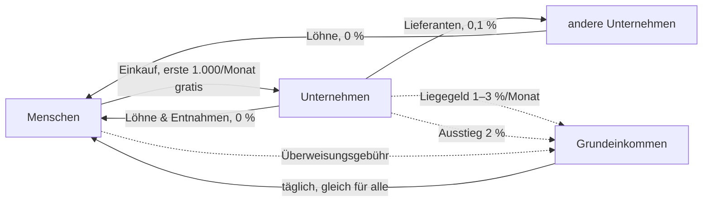

# Aequitas für Unternehmen – Konzept

Stand: 25.09.2026 · Status: **beschlossen und gebaut**, aktiv ab 01.10.2026 (`x/humanity/keeper/wirtschaft.go`)

## In einem Satz

Unternehmen dürfen AEQ annehmen, halten und ausgeben – aber AEQ ist so
gebaut, dass es **durch Unternehmen hindurchfließt und bei Menschen ankommt**:
Liegenlassen kostet, an Menschen weitergeben ist gratis, Aussteigen in
Euro/Dollar kostet eine Abgabe, die ins Grundeinkommen geht.

---

## 1. Warum nicht „Unternehmen nur in USD“?

Die naheliegende Idee – Menschen halten AEQ, Unternehmen nehmen nur Stablecoins –
schützt das Geld nicht, sondern entwertet es:

1. Jeder Einkauf wird zu einem **Verkauf von AEQ** (AEQ → Stable → Händler).
2. Käufer für AEQ gibt es dann kaum: Wofür sollte jemand AEQ kaufen, wenn man
   damit nirgends bezahlen kann?
3. Dauerhafter Verkaufsdruck, **fallender Kurs**, das Grundeinkommen ist immer
   weniger wert. AEQ würde zur Wertmarke, die man sofort loswerden will.

Dazu kommen Reibung bei jedem Einkauf (Tausch, Kursrisiko, Liquidität) und die
Abhängigkeit von einem Stablecoin-Anbieter. **Zirkulation entsteht nur, wenn
Unternehmen AEQ selbst weitergeben können** – an Beschäftigte, Lieferanten,
andere Unternehmen.

## 2. Leitlinien

1. **Das Geld ist für Menschen.** Grundeinkommen, Stimmrecht und der faire
   Anteil gehören nur verifizierten Menschen.
2. **Unternehmen sind Durchlauf, kein Speicher.** Wer AEQ hortet, zahlt. Wer es
   weitergibt, zahlt nichts.
3. **Kein Vorrecht, kein neues Geld.** Für Unternehmen wird kein AEQ geschöpft.
   Alles, was sie zahlen, fließt ins Grundeinkommen.
4. **Hinter jedem Unternehmen steht ein Mensch.** Verantwortung ist nicht
   anonym, das Unternehmen selbst kann es sein.
5. **Einfach für den Laden.** Bezahlen per QR, Preise auch in Euro sichtbar,
   Buchhaltungs-Export. Ohne das nimmt kein Bäcker AEQ an.

## 3. Die Fairness-Garantie für Menschen

Das fairste Geld der Welt muss sich zuerst für den einzelnen Menschen fair
anfühlen, und zwar für den mit wenig. Deshalb gelten für Menschen sechs Zusagen.
Alle Zahlen im Rest dieses Konzepts ordnen sich ihnen unter.

1. **Dein fairer Anteil ist unantastbar.** Auf die ersten 1.000 AEQ (der faire
   Anteil) gibt es nie Demurrage oder Abgabe.
2. **Der Alltag kostet nichts.** Die ersten **1.000 AEQ, die du im Monat
   ausgibst** (an Menschen oder Läden), sind **gebührenfrei**. Die
   Überweisungsgebühr zahlt erst, wer mehr ausgibt.
3. **Lohn ist Lohn.** AEQ, das du als Lohn von einem Unternehmen bekommst,
   kannst du bis 3.000 AEQ im Monat **ohne Abgabe** in Euro/Dollar tauschen.
   Zusätzlich hat jeder
   Mensch **1.000 AEQ im Monat** Tausch-Freibetrag.
4. **Sparen ist erlaubt.** Bis **5.000 AEQ** (5 × fairer Anteil) verliert
   Erspartes nichts. Erst auf den Teil darüber wirkt die Demurrage.
5. **Wer mehr hat, trägt mehr.** Gebühren und Demurrage steigen erst mit großem
   Guthaben. Die Grenze von 25.000 AEQ bleibt.
6. **Halten und Aussteigen kosten Menschen immer weniger als Unternehmen.**
   Die Demurrage für Menschen liegt unter dem Liegegeld für Unternehmen, und **alles, was irgendwer zahlt, geht zu
   gleichen Teilen an alle Menschen zurück.**

Warum die Freibeträge **pro Mensch** gelten und nicht pro Konto: Jeder Mensch
existiert bei Aequitas genau einmal. Ein Freibetrag pro Mensch lässt sich
deshalb nicht vervielfachen. Das kann kein anderes Geld.

## 4. Die Lücke, die dieses Konzept mit schließt

`docs/WHO_MAY_HOLD_AEQ.md` (20.08.2026) regelt: *Jeder darf AEQ halten, jede
Adresse unterliegt Demurrage und Vermögensgrenze.* Zwei Punkte halten im Code
nicht, was die Regel verspricht:

- **Die Vermögensgrenze gilt pro Adresse, nicht pro Mensch.** 25.000 AEQ je
  Adresse (`wealthCapMultiplier` × fairer Anteil). Wer sein Vermögen auf zehn
  unregistrierte Adressen verteilt, hat eine Grenze von 250.000 AEQ. Adressen
  kosten nichts, die Grenze hält also nicht.
- **Demurrage trifft aktive Konten nie.** Sie beginnt erst nach 90 Tagen ohne
  Bewegung (`demurrageGracePeriodSeconds`), jede Bewegung setzt die Uhr zurück.
  Die tägliche UBI-Gutschrift setzt sie bei jedem Menschen zurück, ein aktives
  Unternehmen setzt sie mit jedem Verkauf zurück. Sie ist in der Praxis ein
  Aufräumen verlassener Konten, keine Umlaufsicherung (so auch schon in
  `WHO_MAY_HOLD_AEQ.md` festgestellt).

Ein Unternehmensmodell auf dieser Grundlage hätte weder eine Grenze noch einen
Umlaufanreiz. Deshalb braucht es drei Kontoarten mit klaren Regeln statt einer.

## 5. Drei Kontoarten

| | **Mensch** | **Unternehmen** (neu) | **Freie Adresse** |
|---|---|---|---|
| Wer | verifizierter Mensch | eröffnet von 1–N verifizierten Menschen | jede sonstige Adresse, auch Verträge |
| Grundeinkommen | ✅ | ❌ | ❌ |
| Stimmrecht | ✅ | ❌ | ❌ |
| Obergrenze | 25.000 AEQ (wie heute) | **keine feste** – dafür Liegegeld (6.2) | **1.000 AEQ** (= fairer Anteil) |
| Umlaufsicherung | **0,5 %/Monat nur auf den Teil über 5.000 AEQ** | **Liegegeld: Geld älter als 30 Tage 1 %/Monat, älter als 90 Tage 3 %/Monat** | **1 %/Monat ab dem ersten AEQ** |
| Überweisen | **erste 1.000 AEQ im Monat gratis**, dann 0,1 % (Aufschlag nur bei großem Guthaben) | an Menschen **0 %**, sonst 0,1 % | 0,1 % |
| Umtausch in Euro/Dollar | **Lohn + 1.000 AEQ/Monat ohne Abgabe**, darüber 2 % | 2 % | 2 % |

Umlaufsicherung und Liegegeld laufen bei allen drei Kontoarten **ohne
Schonfrist, und Aktivität setzt sie nicht zurück.** Nur so wirken sie überhaupt
(siehe Abschnitt 4). Für Menschen ist das keine Verschärfung, sondern das
Gegenteil: Heute gilt die Demurrage (auf dem Papier) ab 1.000 AEQ, künftig erst
ab 5.000. Wer normal lebt und spart, ist nie betroffen.

Die **freie Adresse** bleibt für alles Kleine möglich: Geldbörse eines Besuchers,
Test, Trinkgeldkasse, ein einfacher Vertrag. Als Versteck taugt sie nicht mehr:
höchstens 1.000 AEQ je Adresse, und Halten kostet vom ersten Tag an. Wer mehr
Geld dauerhaft außerhalb des eigenen Kontos halten will, eröffnet ein
Unternehmenskonto und steht mit seinem Namen dafür.

Die **Protokoll-Töpfe** (UBI, LP, Validatoren) bleiben wie heute ausgenommen,
sie sind Durchlauf.

## 6. Regeln für Unternehmenskonten

### 6.1 Eröffnen, Mitinhaber, Schließen

- **Eröffnen:** Transaktion `unternehmen_eroeffnen`, signiert von einem
  verifizierten Menschen. Enthält einen Anzeigenamen (freiwillig) und eine
  Kategorie (z. B. Lebensmittel, Handwerk, Dienstleistung, Verein).
- **Mitinhaber:** weitere verifizierte Menschen können beitreten
  (`unternehmen_mitinhaber`, signiert vom Beitretenden und einem bisherigen
  Verantwortlichen). So bildet ein Konto eine GbR, GmbH oder Genossenschaft ab.
- **Grenze:** Jeder Mensch ist für **höchstens 3 Unternehmenskonten**
  verantwortlich. Das verhindert, dass jemand den Sockel (6.2) über viele Konten
  vervielfacht.
- **Schließen:** nur mit leerem Konto. Das Restguthaben zahlen die
  Verantwortlichen vorher aus (an Menschen gebührenfrei). Danach ist die
  Adresse wieder eine freie Adresse.
- **Öffentlich im Explorer:** Anzeigename, Kategorie, Zahl der Verantwortlichen,
  Umsatz- und Lohnsummen je Monat. Website und App zeigen nur die **Zahl** der
  Verantwortlichen. Ehrlich dazu: Auf der Kette ist die Eröffnungstransaktion wie
  jede Transaktion einsehbar, wer genau hinschaut, sieht also die Wallet des
  Verantwortlichen (nicht seinen Namen).

### 6.2 Liegegeld statt Obergrenze: Geld hat ein Alter

Ein Unternehmen hat Umsatz, und Umsatz ist kein Vermögen. Eine Bäckerei mit
40.000 AEQ Monatsumsatz würde an einer 25.000-Grenze scheitern, ohne reich zu
sein. Deshalb gilt für Unternehmen **keine feste Obergrenze**. Stattdessen zählt,
**wie lange Geld liegen bleibt**:

- **Jedes AEQ im Unternehmenskonto trägt ein Alter**: wie lange es schon
  unterwegs ist, ohne bei einem Menschen angekommen zu sein.
- **Bis 30 Tage: nichts.** Normales Geschäft (einnehmen, Löhne und Lieferanten
  bezahlen) bleibt immer darunter.
- **30 bis 90 Tage: 1 % pro Monat.**
- **Über 90 Tage: 3 % pro Monat.**
- **Sockel:** 2.000 AEQ je Unternehmen sind immer frei, egal wie alt.
- Ausgegeben wird **immer das älteste Geld zuerst**, die günstigste Reihenfolge
  für das Unternehmen.
- Wird **täglich verrechnet** (Tageslauf vor dem Grundeinkommen, Transaktion
  `umlauf`), Aktivität setzt nichts zurück. Die Einnahmen gehen **zu 100 % ins
  Grundeinkommen.**

**Das Alter reist mit dem Geld.** Das ist der Kern, der die Umgehungswege
schließt (6.5):

| Woher kommt das Geld? | Alter beim Eingang |
|---|---|
| von einem anderen Unternehmen oder einer freien Adresse | **behält sein Alter** |
| von einem Menschen, bei dem es **weniger als 30 Tage** lag | **behält sein Alter** |
| von einem Menschen, bei dem es **mindestens 30 Tage** lag | **neu**, es war wirklich das Geld dieses Menschen |
| frisch entstanden: Grundeinkommen, Registrierung, Einstieg aus Euro/Dollar | **neu** |

Geld im Kreis zu schicken, über Freunde, eigene Firmen oder Komplizen, macht es
also **nicht jünger**. Nur ein Mensch, der das Geld wirklich einen Monat lang
besessen hat, setzt die Uhr zurück, und ein Mensch kann höchstens 25.000 AEQ
halten.

Für Menschen spielt das Alter **keine Rolle**, bei ihnen gelten nur die Regeln
aus Abschnitt 3. Das Alter wird nur mitgeführt, damit Unternehmen es korrekt
bekommen.

Zum Vergleich: Der Chiemgauer verliert rund 2 % je Quartal (≈ 0,66 %/Monat),
Wörgl 1932 hatte 1 %/Monat. 1 % liegt also in der erprobten Spanne. 3 % gelten
nur für Geld, das ein Vierteljahr lang nirgends ankommt.

### 6.3 Gebühren nach Richtung

| Richtung | Gebühr | Begründung |
|---|---|---|
| Mensch → Unternehmen (Einkauf) und Mensch → Mensch | **0 % für die ersten 1.000 AEQ im Monat**, danach 0,1 % (+ Aufschlag ab 5/10/20 × fairer Anteil). Zahlt der Absender obendrauf | der Alltag kostet nichts. Preis 10 AEQ bringt dem Laden genau 10 AEQ |
| **Unternehmen → Mensch** (Lohn, Entnahme, Erstattung) | **0 %** | der Weg, den das Geld nehmen soll, ist der günstigste |
| Unternehmen → Unternehmen (Lieferant) | 0,1 %, **ohne** den Aufschlag für große Guthaben | Lieferketten sollen nicht bestraft werden, Horten regelt 6.2 |
| Unternehmen → freie Adresse | 0,1 % | |

Der heutige Aufschlag für große Guthaben (+0,1 / +0,5 / +1 % ab 5/10/20 × fairer
Anteil) gilt **nur für Menschen und freie Adressen**. Bei Unternehmen übernimmt
das Liegegeld diese Rolle, sonst würden gerade Unternehmen mit vielen Löhnen
doppelt zahlen.

### 6.4 Umtausch in Euro/Dollar: Ausstiegsabgabe

| Wer tauscht AEQ → Stable | Abgabe |
|---|---|
| Mensch: **erhaltener Lohn** (vom Unternehmen, bei dem man *nicht* Verantwortlicher ist) | keine Abgabe |
| Mensch: dazu **1.000 AEQ je Kalendermonat** | keine Abgabe |
| Mensch: darüber | 2 % |
| Unternehmen | 2 % |
| Freie Adresse | 2 % |

Die Abgabe geht **zu 100 % ins Grundeinkommen.** Die normale Tauschgebühr von
0,1 % (an Liquiditätsgeber, Validatoren und Grundeinkommen) bleibt für alle
bestehen. Stable → AEQ (Einsteigen) kostet nur diese 0,1 %.

**Lohn oder Entnahme?** Die Kette weiß, wer für ein Unternehmenskonto
verantwortlich ist. Zahlungen an Verantwortliche sind **Entnahmen** und erhöhen
den Tausch-Freibetrag nicht. Zahlungen an alle anderen Menschen sind **Lohn**,
und wer für seine Arbeit in AEQ bezahlt wird, kann diesen Lohn ohne Abgabe
tauschen. Eine Restlücke bleibt: Zwei Inhaber könnten sich gegenseitig als
„Angestellte“ bezahlen. Das ist auffällig (öffentliche Lohnsummen im Explorer)
und durch die Vermögensgrenze der Menschen begrenzt.

**Warum ein Freibetrag pro Mensch und nicht pro Adresse:** Ohne ihn könnte ein
Unternehmen seine Einnahmen gebührenfrei an den Inhaber zahlen, und der
tauscht für 0,1 % um. Mit dem Freibetrag lassen sich über diesen Umweg höchstens
1.000 AEQ im Monat pro Mensch herausnehmen. Da jeder Mensch nur einmal existiert,
lässt sich dieser Freibetrag nicht vervielfachen. Das ist der eigentliche Vorteil
von Aequitas: **Regeln pro Mensch sind hier wirklich durchsetzbar.**

Richtwert: Der Chiemgauer verlangt beim Rücktausch 5 %. 2 % liegen darunter und
im Bereich üblicher Kartengebühren für kleine Händler.

### 6.5 Wer ist ein Unternehmen? Wir müssen es nicht wissen.

Ein dezentrales Netz kann nicht prüfen, ob hinter einem Konto eine echte Firma
steht, und soll es auch nicht: Kein Handelsregister, kein Amt, keine zentrale
Stelle entscheidet. Stattdessen gilt:

> **Wir prüfen nicht, was jemand ist. Wir machen Horten in jeder Form teuer
> und Weitergeben in jeder Form billig.**

Dann ist die Anmeldung als Unternehmen **selbst-selektierend**: Für einen echten
Laden, dessen Geld schnell weiterfließt, kostet sie nichts. Für jemanden, der
horten will, ist sie der teuerste aller Wege.

**Beispiel: 100.000 AEQ horten**

| Weg | Kosten |
|---|---|
| als Mensch | **unmöglich**, Grenze 25.000 AEQ |
| auf 100 freien Adressen à 1.000 AEQ | 1 %/Monat = **1.000 AEQ/Monat** |
| als „Unternehmen“ | Monat 2–3: 98.000 × 1 % = 980 AEQ/Monat, ab Monat 4: 98.000 × 3 % = **2.940 AEQ/Monat ≈ 35 % im Jahr** |

**Alle Umgehungswege, die wir gefunden haben, und warum sie nicht funktionieren:**

| # | Trick | Warum er nicht funktioniert |
|---|---|---|
| 1 | Als Unternehmen anmelden, um die 25.000-Grenze zu umgehen | Liegegeld 1–3 % pro Monat, teurer als jede andere Form |
| 2 | Geld zwischen eigenen Firmen im Kreis schicken, damit es „neu“ wird | Das Alter reist mit, zwischen Unternehmen wird nichts jünger |
| 3 | Mit befreundeten Firmen im Kreis zahlen (A → B → C → A), egal wie lang der Kreis ist | Das Alter reist mit |
| 4 | Über den eigenen Inhaber oder einen Freund zurückzahlen (Firma → Mensch → Firma) | Lag das Geld beim Menschen weniger als 30 Tage, behält es sein Alter |
| 5 | Das Geld wirklich 30 Tage bei Freunden parken, damit es neu wird | Jeder Mensch kann höchstens 25.000 AEQ halten und zahlt hin und zurück den Aufschlag für große Guthaben (bis 1,1 % je Richtung) sowie über 5.000 AEQ Demurrage. Für 1 Mio. AEQ bräuchte man 40 Menschen, die das Geld auch behalten *könnten*. Kosten ≈ 2–2,5 % pro Runde bei 1–3 % Ersparnis und vollem Risiko: lohnt sich nicht |
| 6 | Viele Firmen gründen, um viele Sockel zu bekommen | höchstens 3 Konten je Mensch, also höchstens 6.000 AEQ Sockel |
| 7 | Sich selbst als „Angestellten“ bezahlen, um die Ausstiegsabgabe zu sparen | Zahlungen an Verantwortliche sind Entnahmen, kein Lohn (6.4) |
| 8 | Scheinlöhne an Freunde, die in Euro tauschen und das Bargeld zurückgeben | Lohn ist nur bis **3.000 AEQ je Mensch und Monat** abgabefrei. Die Ersparnis (2 %) ist kleiner als das Risiko, und die Lohnsummen sind öffentlich |
| 9 | Zwei Inhaber stellen sich gegenseitig an | wie 8: höchstens 3.000 AEQ im Monat je Mensch, Ersparnis höchstens 60 AEQ |
| 10 | Private Einkäufe über die Firma, um den Aufschlag für große Guthaben zu sparen | Das Geld muss erst in die Firma. Wer es vom Menschenkonto schickt, zahlt den Aufschlag schon dabei |
| 10a | Geld über den Liquiditätspool „verjüngen“ | Liquidität stellen nur Menschen bereit |
| 11 | Ein Vertrag (Smart Contract) als Versteck | Verträge sind freie Adressen: höchstens 1.000 AEQ. Braucht ein Vertrag mehr, wird er als Unternehmenskonto mit verantwortlichem Menschen geführt und zahlt Liegegeld |
| 12 | Das eigene Menschenkonto voll (25.000) und zusätzlich Geld „frisch“ in der eigenen Firma halten | geht nur mit Geld, das einen Monat beim Menschen lag, also höchstens 25.000 zusätzlich je Monat und mit Aufschlag bei jeder Runde. Das ist die Größenordnung der Grenze selbst, kein Schlupfloch nach oben |

**Was ehrlich übrig bleibt:** Kein Geldsystem der Welt kann verhindern, dass sich
viele echte Menschen absprechen. Hier gilt aber für jede bekannte Absprache:
**Sie kostet mehr, als sie spart, oder sie ist auf kleine Beträge begrenzt.**
Dazu sind alle Unternehmensumsätze und Lohnsummen öffentlich, auffällige Muster
fallen also auf. In der Pilotphase wird genau das gemessen. Wer eine neue Lücke
findet, meldet sie, und die Regeln werden per Abstimmung angepasst.

### 6.6 Warum es sich für echte Unternehmen lohnt

| Vorteil | |
|---|---|
| **Keine Kartengebühren** | Zahlungen an den Laden sind für ihn gratis. Für Kunden sind die ersten 1.000 AEQ im Monat auch gratis |
| **Kein Wachstumsdeckel** | Anders als Menschen haben Unternehmen keine 25.000-Grenze. Geld, das innerhalb von 30 Tagen weiterfließt, kostet nie etwas |
| **Gebührenfreie Löhne** | Löhne in AEQ kosten nichts, Angestellte können sie ohne Abgabe tauschen |
| **Günstige Lieferketten** | 0,1 % zwischen Unternehmen, ohne Aufschlag |
| **Sofortige Zahlung** | Geld ist in Sekunden da, keine Rückbuchungen wie bei Karten oder Lastschrift |
| **Neue Kundschaft** | Menschen mit Grundeinkommen suchen Orte, an denen sie es ausgeben können |
| **Sichtbarkeit** | Eintrag im öffentlichen Unternehmensregister als „Aequitas-Partner“ |

Ein Café wie im Beispiel in Abschnitt 8 zahlt im Normalbetrieb **null**.

## 7. Der Kreislauf

Jeder Weg, auf dem AEQ **bei Unternehmen liegen bleibt oder das Netz verlässt**,
speist das Grundeinkommen. Jeder Weg **zurück zu Menschen** ist gratis.

## 8. Rechenbeispiele

### Für Menschen

**Anna** lebt vom Grundeinkommen, hat 1.200 AEQ und gibt 800 AEQ im Monat aus.
Sie zahlt **nichts**: keine Überweisungsgebühr (unter 1.000 im Monat), keine
Demurrage (unter 5.000), keine Abgabe.

**Ben** arbeitet im Café und bekommt 2.000 AEQ Lohn. Er gibt 1.500 AEQ aus und
tauscht 1.000 AEQ für die Miete in Euro. Er zahlt **0,5 AEQ** Überweisungsgebühr
(0,1 % auf 500 über dem Freibetrag) und die normale Tauschgebühr von 1 AEQ.
**Keine Abgabe**, weil es sein Lohn ist.

**Clara** hat 20.000 AEQ, gibt 3.000 AEQ im Monat aus und tauscht 5.000 AEQ in
Euro. Sie zahlt:
- Überweisungen: 2.000 × 1,1 % (Aufschlag ab 20 × fairer Anteil) = 22 AEQ
- Demurrage: 15.000 × 0,5 % = 75 AEQ
- Umtausch: 4.000 × 2 % = 80 AEQ (die ersten 1.000 sind frei)
- zusammen **177 AEQ im Monat**. Alles geht ans Grundeinkommen, also auch an
  Anna und Ben.

### Für Unternehmen

**Café** – Monatsumsatz 3.000 AEQ, Löhne 1.500, Lieferant 800, Entnahme 600.
Das Geld fließt innerhalb eines Monats weiter, nichts wird älter als 30 Tage:
**kein Liegegeld.** Abgaben nur, wenn es in Euro tauscht.

**Supermarkt, der hortet** – 40.000 AEQ fließen im Monat durch, aber
200.000 AEQ liegen dauerhaft auf dem Konto. Da immer das älteste Geld zuerst
geht, sind 40.000 AEQ jünger als 30 Tage, 80.000 AEQ 30–90 Tage alt und
80.000 AEQ älter:
- 80.000 × 1 % = 800 AEQ/Monat
- (80.000 − 2.000 Sockel) × 3 % = 2.340 AEQ/Monat
- zusammen **rund 3.140 AEQ/Monat ins Grundeinkommen**, bis das Geld wieder
  ausgegeben ist. Zahlt er stattdessen Löhne, sinkt die Gebühr, und das Geld
  landet direkt bei Menschen.

**Jemand, der 100.000 AEQ horten will** – siehe Abschnitt 6.5: als Mensch
unmöglich (Grenze 25.000), auf 100 freien Adressen 1.000 AEQ im Monat, als
„Unternehmen“ ab dem vierten Monat 2.940 AEQ im Monat. **Horten lohnt sich
in keiner Form.**

## 9. Was Läden brauchen, damit sie mitmachen

- **Kassenmodus in der App:** Betrag eingeben → QR-Code → Kunde scannt und
  zahlt → Beleg. Preise wahlweise in AEQ oder als Euro-Gegenwert zum aktuellen
  Kurs.
- **Buchhaltungs-Export (CSV):** jede Zahlung mit Datum, Betrag in AEQ und
  **Euro-Wert zum Zahlungszeitpunkt**. Ohne den nimmt kein Steuerberater es an.
- **Sofort-Ausstieg auf Wunsch:** Wer kein Kursrisiko tragen will, tauscht
  Einnahmen automatisch um (2 %). Die Wahl bleibt beim Laden.
- **Argumente für den Laden:** Die Zahlung ist für den Laden gebührenfrei, der
  Kunde zahlt 0,1 %. Kunden mit Grundeinkommen wollen es ausgeben, und Löhne
  lassen sich gebührenfrei in AEQ zahlen.

## 10. Was an der Kette gebaut werden muss

Alles hinter einer **Aktivierungshöhe** (wie `grant_staffel.go`), damit alte
Blöcke gleich nachgespielt werden. Da die Kette vor dem Launch bei null startet,
gibt es keine Altbestände umzustellen.

1. `AccountState`: Feld `Kontoart` (mensch / unternehmen / frei),
   `Verantwortliche []Adresse`, `Alterspakete` (siehe 4.),
   dazu bei Menschen `MonatsAusgaben` (Gebührenfreibetrag), `MonatsTausch` und
   `MonatsLohn` (Tausch-Freibetrag). Alle Zähler springen am Monatsanfang nach
   Blockzeit zurück, damit jeder Knoten gleich rechnet.
2. Neue Transaktionen: `unternehmen_eroeffnen`, `unternehmen_mitinhaber`,
   `unternehmen_schliessen`.
3. `enforceWealthCapLocked`: Unternehmen ausgenommen, freie Adressen auf
   1.000 AEQ.
4. `liegegeld.go`: Alterspakete je Konto (Betrag + Eingangszeit, pro Tag
   zusammengefasst, damit es wenige bleiben), älteste zuerst ausgeben, Alter
   reist bei Überweisungen mit, Rücksetzen nach 30 Tagen bei einem Menschen,
   Stufen, Sockel, sekundengenaue Verrechnung, Gutschrift ans Grundeinkommen.
5. `ueberweisungsgebuehr.go`: Gebühr nach Richtung (6.3) und der
   Monatsfreibetrag von 1.000 AEQ für Menschen.
5a. Demurrage für Menschen: Sparfreibetrag 5.000 AEQ, ohne Schonfrist, ohne
   Zurücksetzen durch Aktivität. Website, Whitepaper und Explorer beschreiben
   heute „0,5 % auf den Teil über 1.000 AEQ“ und müssen mit angepasst werden.
6. Swap AEQ → Stable: Ausstiegsabgabe mit Monatsfreibetrag pro Mensch (6.4).
7. Tests: Verteilen auf Adressen lohnt nicht, Gebühren je Richtung, Umweg über
   den Inhaber ist gedeckelt, Nachspielen ist deterministisch.
8. Explorer: Unternehmensregister. App: Kassenmodus und CSV-Export.

Grober Aufwand: Kette 1–2 Wochen, App-Kassenmodus 1 Woche.

## 11. Recht und offene Punkte (ehrlich)

- **Steuern:** Für Unternehmen sind AEQ-Einnahmen Betriebseinnahmen zum
  Euro-Wert am Zahlungstag. Deshalb ist der CSV-Export Pflicht.
- **MiCA / Finanzaufsicht:** Ob AEQ und der eingebaute Tausch unter die
  EU-Kryptoverordnung fallen, muss **vor echtem Geld** rechtlich geprüft werden.
  Das betrifft das ganze Projekt, nicht nur Unternehmen.
- **Echter Stablecoin:** Heute gibt es nur tUSD (Testwährung). Für echten
  Ausstieg braucht es einen regulierten Euro-Stablecoin (z. B. EURC) und eine
  Brücke. Das kommt erst nach der rechtlichen Prüfung.
- **Kursrisiko für Läden:** Solange AEQ klein ist, schwankt der Kurs. Der
  Sofort-Ausstieg (9.) ist die Antwort für vorsichtige Läden.
- **Die Zahlen sind Startwerte** (Sockel 2.000, 30/90 Tage, 1 %/3 %, 2 %, 1.000 und 3.000/Monat).
  In der Pilotstadt messen, dann per Abstimmung der Menschen anpassen.

## 12. Einführung in Schritten

1. **Entscheidung** über die Zahlen in Abschnitt 13.
2. **Kette** bauen und testen (Abschnitt 10), vor dem Neustart bei null.
3. **App**: Kassenmodus und Export.
4. **Pilotstadt**: 5–10 Läden (Café, Bäcker, Hofladen, Friseur, Werkstatt), drei
   Monate, messen: Wie viel bleibt im Kreislauf, wie viel geht raus, wie viel
   landet im Grundeinkommen?
5. **Rechtliche Prüfung** und echter Stablecoin, dann breiter öffnen.

## 13. Zu entscheiden

| Frage | Vorschlag |
|---|---|
| Liegegeld Unternehmen | Geld älter als 30 Tage 1 %/Monat, älter als 90 Tage 3 %/Monat, Sockel 2.000 AEQ |
| Wann wird Geld wieder „neu“ | nach 30 Tagen bei einem Menschen, oder frisch entstanden |
| Ausstiegsabgabe | 2 % (Menschen: erste 1.000 AEQ/Monat zu 0,1 %) |
| Obergrenze freie Adresse | 1.000 AEQ, 1 %/Monat ab dem ersten AEQ |
| Unternehmenskonten pro Mensch | höchstens 3 |
| Löhne/Entnahmen an Menschen | gebührenfrei |
| Wohin gehen alle Abgaben | 100 % Grundeinkommen |
| **Menschen:** gebührenfreie Ausgaben | 1.000 AEQ im Monat |
| **Menschen:** Sparfreibetrag (keine Demurrage) | 5.000 AEQ |
| **Menschen:** Demurrage darüber | 0,5 %/Monat |
| **Menschen:** Umtausch ohne Abgabe | erhaltener Lohn (bis 3.000 AEQ) + 1.000 AEQ im Monat |

## Vorbilder

- **Chiemgauer** (Bayern, seit 2003): Regionalgeld mit Umlaufsicherung, 5 %
  Rücktauschgebühr zugunsten von Vereinen, hunderte teilnehmende Geschäfte.
- **WIR-Bank** (Schweiz, seit 1934): Verrechnungsgeld zwischen Unternehmen,
  stabilisierend in Krisen.
- **Wörgl** (Österreich, 1932): Schwundgeld mit 1 %/Monat. Das Geld lief so
  schnell um, dass die Gemeinde damit Straßen und Brücken baute, bis die
  Nationalbank es verbot.
